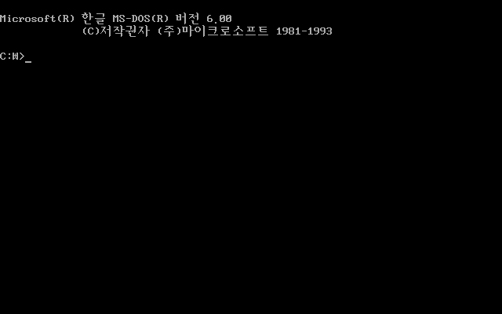
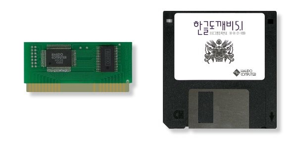
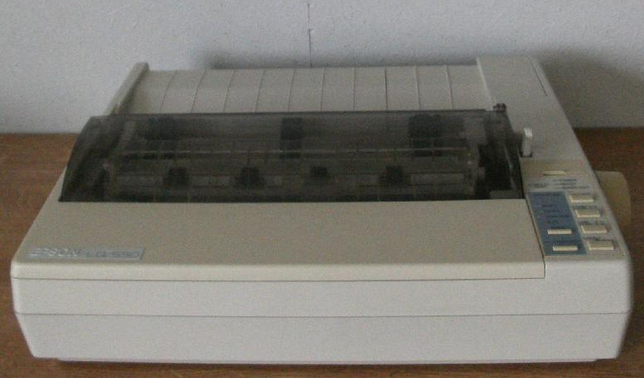
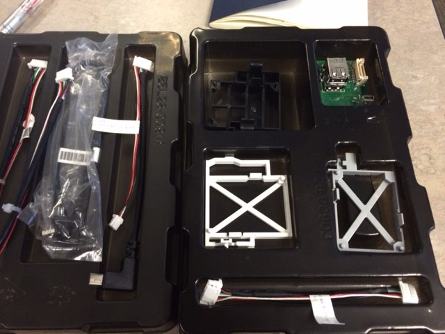
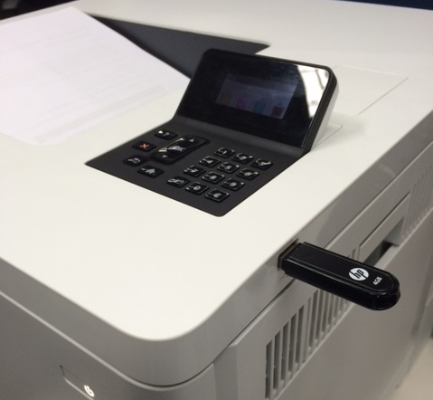

가끔 고객사나 채널에서 프린터 한글 폰트 솔루션 문의가 들어온다. HP 내부 직원 중에도 가끔 나에게 문의를 하는 경우가 있었다. 이런 문의를 하는 사람들 중에는 프린터용 한글 폰트 솔루션에 대한 지식을 가지고 있는 사람은 극히 드문 것 같아 이번 포스트에서 한글 폰트 솔루션에 대해서 간략히 알아 보고 어디에서 구매를 해야 하는지 정보를 공유토록 하겠다.

### 한글 폰트 솔루션이란?

요즘 프린터에서 한글 문서가 출력되는 것은 당연하다고 생각하겠지만 1980년대 말 1990년대 초만 하더라도 결코 당연한 것이 아니었다. PC에서 한글을 처리하는 것은 보통 복잡한 일이 아니었다. MS Windows 이전 MS-DOS (Disk Operation System) 시대에는 모니터 화면에 한글을 표시하려면 특별한 하드웨어나 소프트웨어가 필요했었다. 왜냐 하면 PC가 영문권 국가에서 개발되었기 때문에 한글에 대한 고려는 전혀 되어 있지 않았다. 이는 한글뿐만 아니라 고유한 언어를 사용하고 있는 중국, 일본, 태국 등 아시아 국가들의 공통된 이슈였다.

시간이 지남에 따라서 한글을 구현하기 위한 표준이 만들어지고 여러 가지 솔루션이 나타나기 시작했다. 대표적인 방식이 한글 폰트와 2Byte 한글을 PC에서 처리하기 위한 로직을 PC 슬롯에 장착하는 도깨비 카드 같은 것이 청계천이나 용산에서 많이 판매가 되었다. 그리고, 아래아 한글 같은 DOS 용 한글 워드프로세서가 출시되었다. 이러한 워드프로세서로 주로 한글 문서를 작성해서 프린터로 출력을 했는데 프린터 역시 한글 출력이 쉽지 않았었다.

DOS 환경에서 프린터에서 한글 출력을 하려면 PC 화면에서 한글을 출력하는 것과 마찬가지로 프린터 내에 2Byte 한글을 처리할 수 있는 로직 (인코딩) 과 한글 폰트가 내장되어 있어야 가능했다. 어쨌든 이 당시 PC를 다룰 수 있는 사람들은 지금과 달리 엄청난 지식이 필요했었던 시절이었다.

이 당시 EPSON 도트 프린터를 사용했었는데 아래아 한글에서 한글을 올바로 출력하기 위해서는 프린터 바닥면에 딥스위치라는 것을 소프트웨어 설정과 맞춰줘야 했었다. 이유는 한글 처리 방법이 완성형, 조합형, KS, KSSM 등 여러 가지가 혼재되어 있는 상황이었기 때문에 이를 맞춰줘야 했었던 것이다.

한글 폰트 솔루션이라 이처럼 프린터에서 한글을 올바로 출력하기 위한 솔루션이다. 그러나, 세월이 흐르면서 이제 더 이상 이런 복잡한 내용을 몰라도 Windows OS 에서 한글을 아무 문제 없이 출력이 가능하게 되었다.

### 그럼 왜 아직도 한글 폰트 솔루션을 찾는 고객이 있는가?

고객이 사용하는 인쇄용 소프트웨어 중에서 한글 처리 방식이 DOS 시절과 유사한 것들이 아직도 사용되고 있다면 믿을 수 있겠는가? 그러나, 사실이다.

ERP 소프트웨어나 외국계 기업 중 유통, 제조사 출력 어플리케이션 중에서 프린터에 한글 폰트가 없으면 출력물에 한글이 표시되지 않거나 특수 문자로 깨져서 출력되어서 무슨 글자인지 알아 볼 수 없는 것 들이 있다. 대부분 UNIX, IBM 메인 프레임에서 대량을 데이터를 프린터로 출력하는 경우에 이러한 아시안 폰트 솔루션이 필요하다. 예전에 Walmart 가 한국에서 비즈니스를 할 때도 아시안 폰트 솔루션이 필요했었다.

그리고, 연속 용지를 사용하는 도트 프린터용 출력 어플리케이션을 레이저 프린터로 전환해서 사용하는 경우에도 폰트 솔루션이 필요하다.

### HP 공식 아시안 폰트 솔루션 파트너 (판매처) 정보

고객이 한글 폰트 솔루션이 필요하다고 하면 AnV 라는 HP 솔루션 파트너를 통해서 구매하면 된다. 한글 폰트 솔루션은 구매 전에 고객이 사용하거나 구매하려는 프린터와 호환이 되는지 반드시 확인을 해야 하므로 아래 AnV 담당자에게 미리 확인을 하고 구매를 하면 된다.

- ㈜ 에이앤브이
- 강우현 이사
- [전화] 02-869-2872, [팩스] 02-869-2873
- [이메일] <whkang@anv.co.kr>
- [홈페이지](http://http://www.anv.co.kr)

### 아시안 폰트 솔루션 구매시 유의 사항

2015년 봄부터 출시되는 LaserJet M552, M553, M604, M605, M606 제품부터 프린터 내부 메인 보드 내에 USB 포트를 없앴다. 아시안 폰트 솔루션은 프린터 메인보드에 있는 USB 포트 (프린터 뒤쪽이 아닌 보드를 꺼내서 장착하는 방식임)에 장착하는데 이러한 신제품부터는 아시안 폰트를 내부 보드에 장착하기 위해서는 아래 액세서리를 구매해야 한다.

- 제품명(제품번호): HP Internal USB Ports (B5L28A)
- List Price (VAT 별도): 42.02 USD
- 제품 사진

㈜ HP Internal USB Port 가 없이도 프린터의 Walkup USB 포트에 한글 폰트 솔루션을 장착해도 솔루션이 작동하지만 외부에 한글 폰트 솔루션이 노출되어 있어서 누군가가 빼거나 건드릴 수가 있기 때문에 프린터 내부에 장착해 놓고 사용하는 것을 추천한다.

