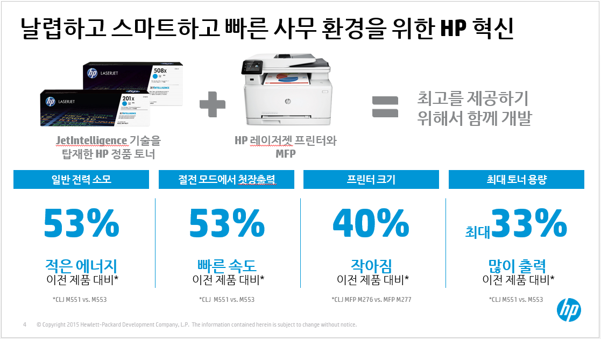
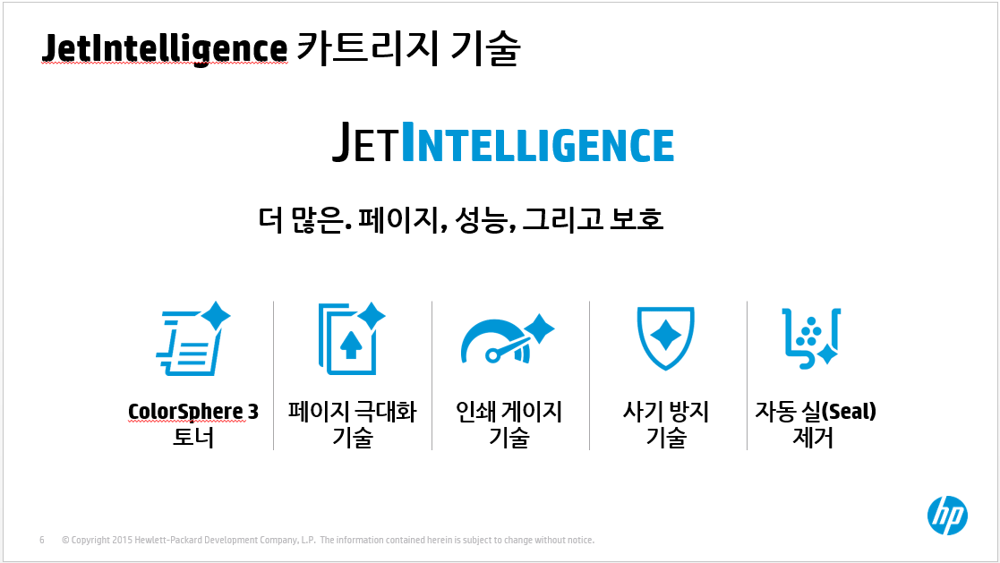
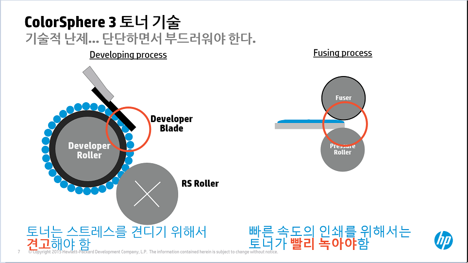
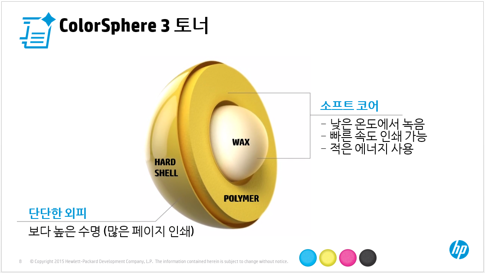
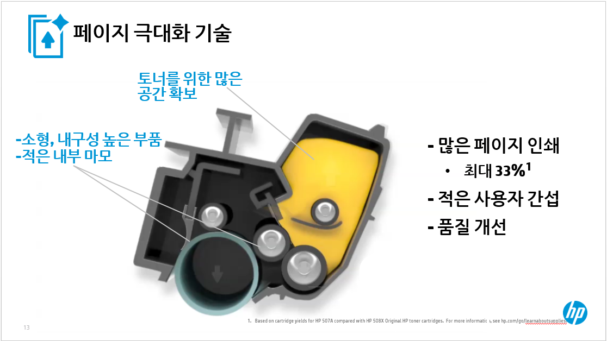
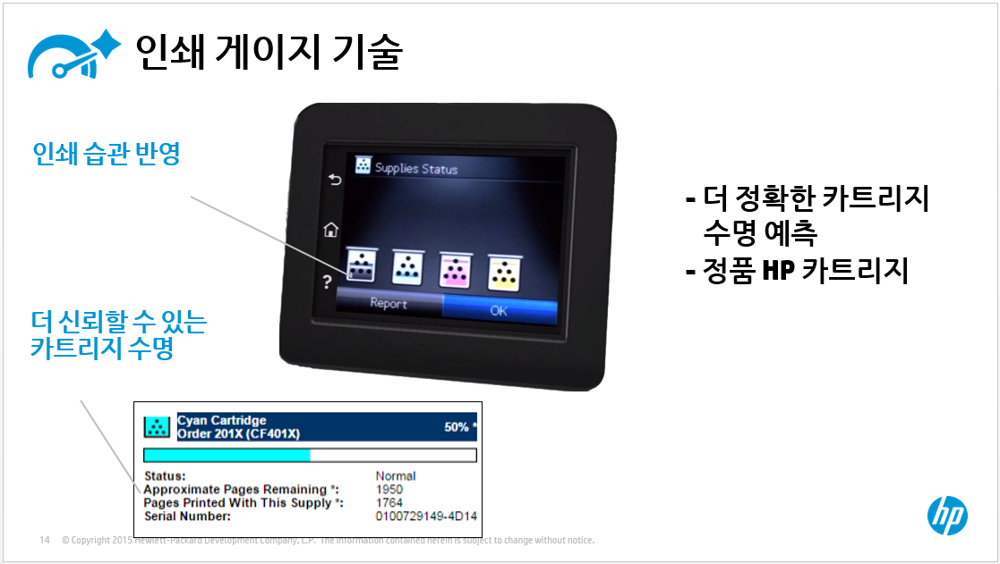
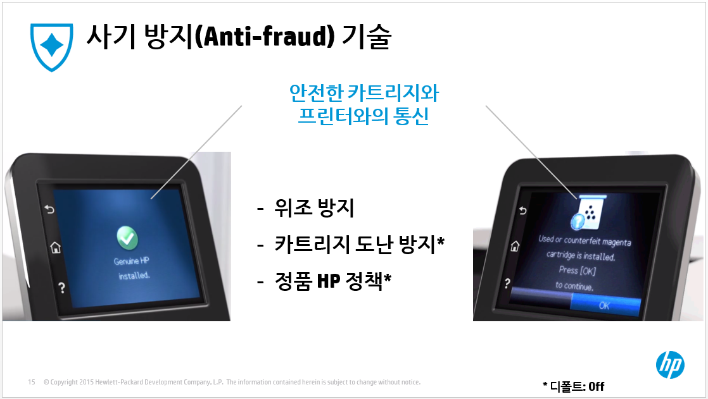
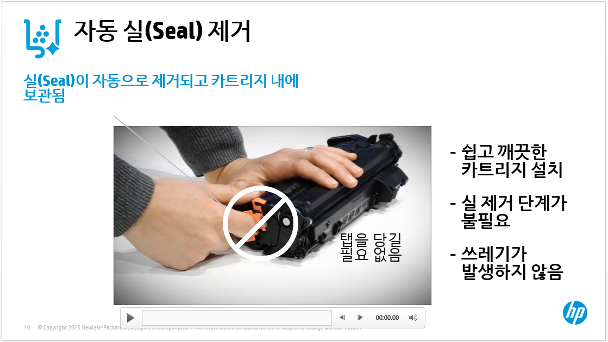
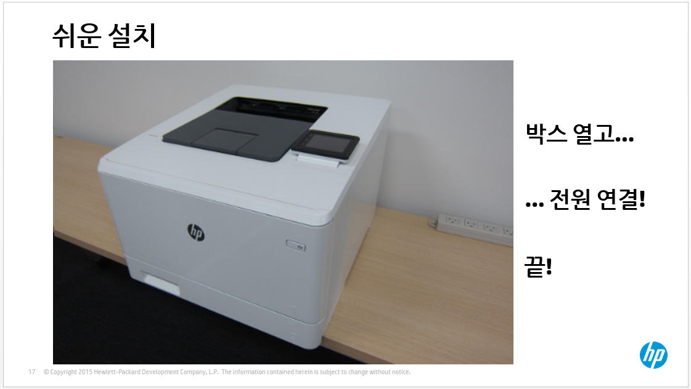
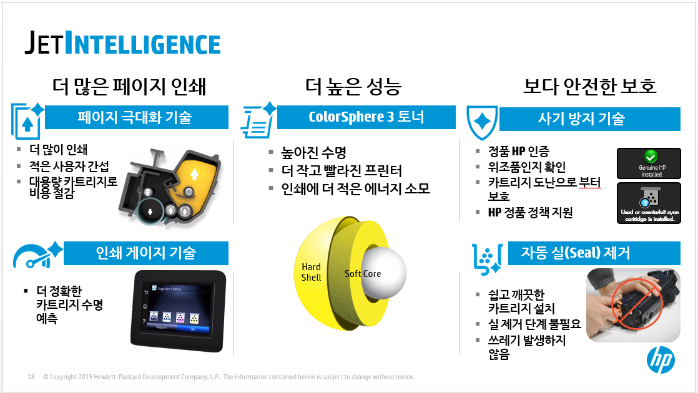

오늘 소개해 드릴 것은 요즘 신제품에 항상 따라 다니는 젯인텔리전스 정품 HP 토너 카트리지입니다. 용어 자체는 많이 나오는데 정확히 이 기술이 무엇인지 설명하라고 하면 설명하기가 참 애매합니다. 이 기술은 앞으로 출시될 모든 레이저젯 프린터에 적용될 것이기 때문에 잘 알아 두면 몇 년간 써 먹을 수 있는 아이템입니다. 이번 기회에 젯인텔리전 기술에 대해서 잘 이해하시기를 기대합니다.

### HP 젯인텔리전스

HP에서는 과거에 어떤 레이저젯 프린터보다 작으면서 빠르게 만들기 위해서 전체 프린팅 시스템을 완전히 재설계를 했습니다. 이것이 바로 젯인텔리전스 기술입니다. 고객에게 보다 전문적인 품질의 출력물과, 빠른 인쇄 성능을 제공하기 위해서 이러한 혁신적인 기술을 사용했습니다.

### HP 프린팅 과학

먼저 HP 프린팅 과학이라는 비디오를 아래 YOUTUBE 링크를 클릭해서 시청하시기 바랍니다. HP 레이저 프린팅 원리를 이해하실 수 있습니다.

<iframe width="854" height="480" src="https://www.youtube.com/embed/edqkPUJudPk" frameborder="0" allowfullscreen></iframe>

### HP 혁신 기술

젯인텔리전스 기술이 탄생한 것은 날렵하고 스마트한 사무 환경을 위해서 제품 크기를 줄이고도 성능을 높이고 출력량은 오히려 늘리면서 에너지 소모는 줄인 제품을 개발하기 위해서였습니다.

요즘 사무 환경은 날로 작은 공간을 차지하면서도 고성능에 에너지 효율이 높은 제품을 요구하고 있기 때문입니다. (울트라 북, 태블릿 등의 모바일 기기, 그리고 미니 PC와 같이 공간 효율이 높은 제품의 수요가 생기는 것을 보면 충분히 납득이 갑니다)

동영상에서 보셨듯이 이러한 목표를 달성하기 위해서 HP에서는 작은것 부터 모든 것을 다시 설계했습니다. 작은 것은 지름이 사람 머리카락의 1/12인 토너를 말합니다. 기본적으로 전면적인 프린터 엔진 설계를 바꾸기 전에는 이러한 목표 달성은 불가능합니다.

토너는 아무 것도 아니라고 생각하실지 모르지만 토너 기술이 레이저 프린팅 기술에서 차지하는 비중은 매우 매우 큽니다. PC에서 CPU가 차지하는 중요도와 유사합니다. 토너나 잉크가 변경된다는 것인 프린팅 엔진의 변경을 의미합니다.

### 젯인텔리전스 카트리지 기술

젯인텔리전스 기술은 크게 다음 다섯 가지 기술로 구성되어 있습니다.

- ColorSphere3 토너
- 페이지극대화 기술
- 인쇄 게이지 기술
- 사기 방지 기술
- 자동 실(Seal) 제거

하나씩 살펴 보도록 하겠습니다.

### 기술적 난제

레이저 프린팅에서 하나를 출력물이 출력되기 위해서는 많은 단계를 거칩니다. 높은 성능과 높은 출력 품질을 유지하기 위해서 극복해야 할 여러 가지 기술적 난제가 있습니다.

레이저 프린팅의 토너 카트리지 내부의 토너는 인쇄 시 계속해서 회전을 합니다. 때문에 토너가루가 계속해서 부딪히면서 스트레스를 받기 때문에 견고하게 만들지 않으면 깨지면서 출력 품질에 문제를 일으킵니다. 또한 고속 출력을 위해서는 토너 정착(퓨징) 과정에서 빠르게 토너 녹여서 종이에 토너를 정착시켜야 하기 때문에 토너가 낮은 온도에서 쉽게 녹고 압착이 잘 될 수 있게 토너가 부드러워야 합니다.

서로 상충되는 견고하면서 부드럽게 만들어야 하는 기술적 난제에 봉착하게 됩니다.

### HP 컬러스피어3 토너 기술

**이러한 기술적 난제를 HP는 ColorSphere 3 토너를 개발해서 해결했습니다.** ColorSphere 3 토너는 단단한 외피와 소프트 코어를 기반으로 한 새로운 토너 디자인입니다. 새로운 차세대 저융 토너 (낮은 온도에서 녹는) 토너로 고객에게 가치를 제공합니다. 

### 페이지 극대화 기술

#### 페이지 극대화 기술 (Page maximizer technology) 
더 많은 페이지를 인쇄를 할 수 있도록 하는 기술입니다. 출력량을 늘리려면 토너 용량을 늘리면 되지 않느냐고 하겠지만 토너양을 늘리면 토너 카트리지가 커지지 때문에 제품 크기가 대형화되는 문제가 있습니다. 또한 토너량을 늘리면 더 많은 페이지가 출력되기 때문에 카트리지 내의 회전 파트들의 마모가 더 심해지기 때문에 토너가 새거나 파트가 견디지 못하고 부서질 수 있습니다. 때문에 토너양이 늘어나면 그에 따라 카트리지 내 부품들의 내구성도 같이 증가가 되어야 합니다. 즉, 더 많은 페이지를 인쇄하기 위해서는 토너 카트리지 내의 부품의 마모를 최소화하면서 공간 효율적인 디자인이 필요합니다. 공간 효율이란 이전 제품 대비 동일한 토너 크기를 유지하면서 더 많은 인쇄를 할 수 있도록 하는 것입니다. 

#### ColorSphere 3 
토너 기술을 장점과 작고 내구성이 개선된 부품, 카트리지 시스템 내 마모를 줄임으로써 HP는 전체 프린터의 성능을 개선하고 고객에게 더 많은 인쇄를 할 수 있도록 합니다. 

젯인텔리전스 기술을 탑재된 정품 HP 토너 카트리지는 이전 동급 프린터 대비 최대 **33%** 출력량을 늘릴 수 있습니다.

이는 고객이 프린터 카트리지를 교체하기 위해서 자주 프린터로 가지 않아도 되므로 고객의 시간과 비용을 절감시켜 줍니다. 페이지 극대화 기술은 또한 컬러 레이저 프린터에서 시스템 마모를 체크할 수 있도록 도움을 줍니다.

HP는 고객마다 인쇄 패턴이 다른 것을 이미 알고 카트리지를 디자인했습니다. ISO 페이지 출력량 이하 고객은 (커버리지가 ISO 표준보다 낮은 경우) 카트리지를 마모도가 올라갑니다.

### 인쇄 게이지 기술

### 사기 방지 기술

어떤 카트리지가 설치되어 있는지 안전하게 인증을 합니다. 고객은 이제 다음을 할 수 있습니다.

- **위조 토너 확인**: 정품을 가장한 위조 토너를 체크
- **토너와 프린터를 묶어서 카트리지 도난을 줄일 수 있음**: 특정 프린터에서 사용 중인 토너를 다른 프린터에 장착하면 출력이 안됨. 예를 들어서 회사와 집에서 동일 기종의 프린터를 사용하는 경우 회사에서 사용 중이던 토너 카트리지를 집에 프린터에 장착하면 출력이 안됨
- **정품 토너만 사용하는 정책**을 강제할 수 있음

### 자동 실 제거

토너 배송 동안에 토너 내부에 토너를 보호하기 위해서 보호 스트립이 있습니다. HP는 토너 보호용 실을 토너 내부에 통합을 시켜서 토너를 설치하면 자동으로 제거가 됩니다. 즉, 더 이상 스트립을 당기지 않아도 됩니다.

고객은 바로 인쇄가 가능합니다.

- 빠르고 간편한 카트리지 설치
- 스트립 제거 단계가 필요 없음
- 쓰레기 발생하지 않음 (스트립)
- 소모품 설치로 복잡하지도 혼동스러워할 필요 자체가 없음

### 쉬운 설치

### 요약

요약하면, 젯인텔리전스로 인해서

- 고객들에게 더 좋은 가치를 제공하고 HP 프린터를 시장에서 더 경쟁력 있게 만듭니다.
- 시장에서 HP를 차별화하는데 매우 긍정적인 영향을 줄 것으로 기대합니다.
- 마지막으로 젯인텔리전스 기술이 탑재된 레이저젯 신제품 소개 동영상 링크를 공유하면서 마치도록 하겠습니다.

<iframe width="854" height="480" src="https://www.youtube.com/embed/2ghmMGHdVt8" frameborder="0" allowfullscreen></iframe>
