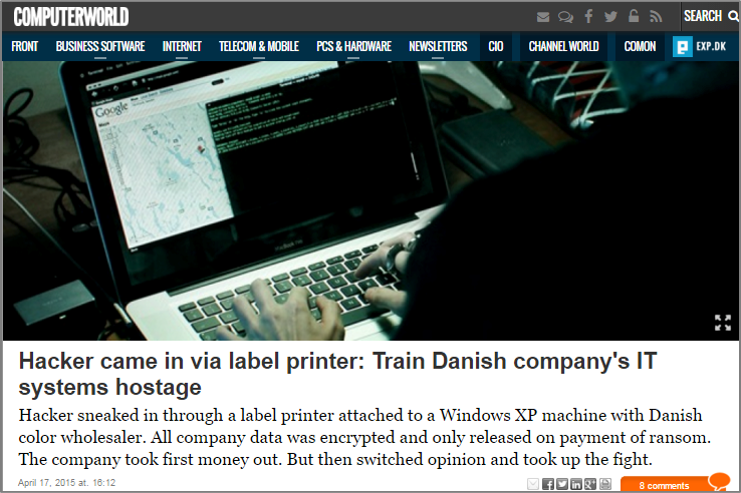

얼마 전 모 고객사를 대상으로 진행한 보안 세미나 때 발표한 내용을 요약해서 정리했습니다.

## 프롤로그

안녕하세요?
HP Inc 에서 프린팅 분야 기술영업을 맡고 있는 홍순모부장입니다.

HP 프린팅 기술 영업은 15년 남짓하고 있고 HP 입사 전에는 서버 시스템, 네트웍 장비 필드 엔지니어를 했었습니다. 오늘은 발표는 프린팅 보안에 관련된 내용을 가지고 약 30분간 진행을 하겠습니다.

보안에 관련된 많은 세미나, 워크샵들이 있습니다만 프린팅만 가지고 하는 경우는 매우 적습니다. 제가 지난 주에 1년에 한번씩 HP 기술영업이나 딜리버리 컨설턴트를 대상으로 진행하는 WW 교육을 다녀 왔는데 1주일 간 여러 가지 과목을 선택해서 교육을 합니다. 프린팅 보안에만 관련된 교육이 하루 가까이 진행이 되었습니다. 또한 CISA, CISM, CEH, ISO 27001, … 등 보안 전문가를 리쿠르팅을 해서 Region 별로 배치해서 Security Advisory Service 를 하기 시작했습니다.

그 만큼 HP에서는 보안 분야에 인적, 물적 투자를 하고 있습니다.

## 시장 상황

세계는 빠르게 변화하고 있습니다.

### 데이터 증가
IDC에 의하면 2020년 까지 데이터는 40 제타 바이트 까지 증가할 것이라고 전망하고 있습니다. 2015년 기준으로 약 15배가 증가하는 량입니다. (제타 바이트는 10에 21승, 1제타 바이트는 데이터센터 1,000개에 해당되고 뉴욕 멘하탄 면적의 20%를 채울 수 있는 규모). 기계(Machine)에서 생성한 데이터가 증가의 주된 원인입니다.

### 클라이언트 증가
가트너에 의하면 2020년까지 **250 억개**의 사물(Thing) 이 인터넷에 연결될 것이라고 예상하고 있음 (2015년 기준 약 49억개)

### 보안위협 증가
데이터의 폭발적 증가와 네트웍에 연결된 클라이언트의 증가는 엔드포인트를 통한 사이버 범죄의 가능성을 높임, 2014년 많은 기업들의 보고에 의하면 매년 48%의 사이버공격이 지속적으로 증가하고 있다고 함

여러 가지 보안 위협으로 인한 손실이 발생하고 있습니다.

### 사이버 범죄
포브스 글로벌 2000 기업들 중 지난해 (2012년 기준) **92%** 데이터 유출 보고

### 내부 위협
**65%** 가까이가 사고, 직원의 무관심 또는 비즈니스 프로세스 오류로 발생

### 컴플라이언스 침해
글로벌 조직의 규정 위반으로 인한 비용 상승

### 재정적 손실
벌금, 비즈니스 손실, 기업 평판이 나빠지고 소송 비용 발생

년간 사이버범죄로 인한 평균 비용이 **7.7백만 달러**…우리 돈으로 약 90억원이 넘습니다.
프린터는 사이버 공격에 대한 자연 방어 능력을 가지고 있지 않다 (면역성이 없다) 악의적인 공격, 실수로 인한 위반, 법적 규정 미준수 등… 보안 위반을 해결하는데 많은 비용이 엄청날 수 있고 이러한 비용은 벌금, 소송뿐만 아니라 사업 손실로 인해서 손상된 기업의 평판, 경영권 약화, 고객 매출 감소를 모두 포함할 수 있음

유명 침투 테스터인 Peter Kim 은 그의 저서인 “The Hacker Playbook 2: Practical Guide to Penetration Testing” 에서 보안 설정(조치)가 되어 있지 않은 프린터를 통해서 네트웍에 침투하는 것은 어렵지 않다고 했습니다.

- 나는 여러 복합기를 조사 (Probing)… 기본 암호로 구성되었는지 확인한다. 좋아 이제 들어간다…”
- 많은 회사들이 최초 프린터 설정을 그대로 사용하고 있다는 것을 알았다. 프린터로 침투 후 액티브 디렉토리 (AD)를 찾고 계정 조회를 수행…빙고

## 사례

### 시카고 드폴 (DEPAUL) 대학

프린터들이 해킹된 것이 의심되어서 보안 조치를 취하고 있다.

약 29,000대의 인터넷에 연결된 프린터들이 열려 있는 포트를 통해서 증오 전단지를 자동으로 출력할 수 있도록 악용 (해킹) 될 수 있다고 해커들이 주장했다. 이러한 전단지들이 프린스턴, 브라운, UC버클리, 드폴, 애머스트, 스미스 대학 등지에서 이번 주에 발견되었다. (2016년 3월 25일)

- [기사링크 (AntiSemitism Watch)](http://www.antisemitismwatch.com/tag/the-washington-times/)
- [기사링크 (NBC NEWS)](http://www.nbcnews.com/news/us-news/printers-12-colleges-spew-hate-fliers-suspected-hack-n545656)

### 드론을 이용한 무선 프린터 해킹 시연

싱가포르 연구진은 드론에 스마트폰을 탑재해서 무선 프린터를 해킹하는 시연을 했음

<iframe width="854" height="480" src="https://www.youtube.com/embed/-jsMS7faqHo" frameborder="0" allowfullscreen></iframe>

(주) 이러한 해킹을 막기 위해서는 프린터/복합기 내의 접근 제한 설정을 해야 함

### 덴마크 회사 해킹 (랜섬웨어) 사례

덴마크의 페인트 회사 (Danish company Aalborg Paint and Varnish) 에서 2015년 1월 21일 수요일에 랜섬웨어로 인해서 모든 IT 시스템이 마비되는 사태가 발생했습니다. 모든 직원이 재무 시스템, 고객 정보와 메일 시스템에 접근이 차단되어서 업무를 위해서는 종이에 모든 것을 기록해야만 했습니다. 여러분도 아시다시피 랜섬웨어는 해커가 제공한 키가 없이는 암호화된 파일을 풀 수가 없습니다. 일종의 IT 인질극입니다.

사태가 발생 후 경찰이나 보험사에서 약간의 도움으로 회사에서 할 수 있는 조치를 취했습니다. 오래된 장비의 선을 자르고 새로운 장치를 구매하고 IT에서 최근에 백업한 일부 자료를 복구했습니다. 해커는 몸값 지불 후 조치를 약속하지 않았습니다.

그럼 해커가 최초로 어떻게 IT 시스템에 침투할 수 있었을까요? 클라우드 시스템을 통해서였을까요? 비보안 모바일폰? 내부자의 소행이었을까요?

아닙니다. 범인은 네트웍으로 연결되어 있는 라벨 프린터였습니다.

(주) HP 프린터/복합기의 내장 보안 기능인 "Runtime Intrusion Detection" 으로 이러한 유형의 해킹을 방지할 수 있음

## 프린터 보안에 대한 국내 움직임

국내에서도 이러한 보안 위협에 대한 위험을 인식하고 국가공공기관의 디지털 복합기 관련 보안 강화 지시가 있었고 수많은 보안 관련 문의가 각 벤더의 콜센터를 통해서 접수가 되었습니다. 각 복사기 벤더의 영업 부서에서는 여러 보안 관련 문의로 인해서 업무가 마비되는 사태가 벌어졌습니다.

앞으로 도입하는 장비 (프린터/복합기)에 대해서 22가지 사항에 대한 보안 체크 리스스를 확인하고 구매하고 체크 리스트 중 기기에서 기능을 지원하지 않을 경우 외부 시스템이나 기타 보안 방안을 준비하라는 내용입니다. 가장 중요한 사항은 기기내 잔류 데이터에 대한 보안입니다.

- 사용자 데이터 보호
- 업데이트 및 백업
- 감사기록
- 식별 및 인증
- 보안 관리
- 전송데이터 보호
- 자체시험
- 안전한 세션관리

또한 신규 구매 장비뿐만 아니라 현재 사용 중인 기기에 대해서도 운영 지침에 따라서 운영하라고 권고하고 있습니다.

- 복합기 내 저장 장치 (HDD, SSD) 잔여 데이터에 대한 보호
- 공유 저장소 (복합기 메일 박스) 사용 금지
- 관리자 PC 이외의 접근 제한
- 전송 암호화 (IPSec)
- 고정 IP
- 관리자 계정/암호 관리
- 불필요한 Port 비활성화
- SNMP v1/v2 Read Only 로 설정, SNMP v3 사용
- HTTPS (SSL) 사용
- USB 메모리 사용 제한
- 방화벽
- 감사 (Audit)
- 복합기의 디지털 전송 등의 기능 때문에 내부망에서만 접속 (즉, 인터넷망 복합기 연결 금지)
- 팩스, 네트웍 포트 분리 (CC인증에서 커버)
- 취약성이 없는 펌웨어 사용
- 무선 등 보안에 취약한 기능은 기본으로 비활성화 (기본 설정)
- 기타 등등

## 프린터 보안에 대한 낮은 인식

스파이스웍의 최근 연구에 의하면 IT 전문직 18% 만이 프린터를 중간 또는 높은 위험의 보안 관리 대상으로 보고 있음, IT 전문가 대부분이 서버 (93%), 데스크탑/랩탑 (100%) 에 대한 보안을 수행 있었으며 – 그리고 약 2/3 가 모바일 기기에 대한 보안 (67%) 을 수행하고 하고 있었음

단지 44%가 네트웍 프린터에 대한 간단한 보안을 취하고 있었습니다. 사실 단지 서베이 한 16%의 IT 전문가만이 프린터에 인증서를 배포하고 있다고 합니다.

### 세부사항….

서베이에 의하면 프린터 보안을 하고 있다고 응답한 IT 전문가들을 사용자 인증 (47%), SNMP에 대한 관리자 암호 설정 (44%), EWS의 관리자 암호 (43%), 와 프린터/복합기 기능 제한 (42%) 통해서 보안을 하고 있다고 했음 – 그러나 이러한 수준 이상 프린터 보안을 이행하고 있는 조직은 거의 없었음.

접근 제한 (Access Control)만 가지고는 충분치 않다.

## 프린터에서의 보안 위협

확실한 프린트 보안 계획에는 단지 장치 접근 뿐만 아니라 장치에 들어가고 나가는 데이터 스트림, 하드 카피 문서에 대한 보안이 포함되어야 한다. (Device, Data, Document)

HP MFP 는 기본적으로 네트웍에 연결된 컴퓨터와 같습니다.

데이터를 송,수신하고 저장한다; 데이터는 단지 페이지 위에 점으로 표현할 뿐이다. 그렇기 때문에 네트웍에 연결된 PC 또는 서버와 같은 수준으로 관리가 되어야만 한다.

- 회사의 랩탑/데스크탑을 사용하기 위해서는 가장 먼저 사용자 인증과 네트웍에 연결할 수 있는 권한을 얻어야 함
- 그러나, 대부분의 복합기, 프린터의 기능을 제한 없이 사용하고 회사 계정을 통해서 어떤 작업을 하는지에 대한 추적이 이루어지고 있지 않습니다.

보안 되지 않은 프린팅 장비는 여러가지 취약점이 있습니다.

- **네트웍** – 프린팅 작업은 네트웍 상에서 이동시 중간에서 가로 챌 수 있습니다. 적절한 방화벽과 보안 인증서가 없다면 쉽게 네트웍 침투 경로가 될 수 있습니다. Man-in-the-middle-attack 을 통해서 정보 (인쇄작업) 가 랩탑이나 데스트탑으로 보내 질 수 있습니다. 예를 들어서 대학생이 교수가 인쇄하는 인쇄 작업을 가로챌 수 있습니다. 시험 치팅을 하고자 한다면 충분히 가능합니다. 이러한 일이 회사에서 발생한다면 얼마나 위험한 일이겠습까?
- **BIOS/펌웨어** – 펌웨어는 부팅 중이나 실행 중에 변조되어서 장치에 접근하거나 네트웍 공격에 사용할 수 있습니다.
- **스토리지 미디어** – 프린팅 장치 (복합기)에는 민감한 정보를 내부 디스크에 저장하는데 이를 보호하지 않는다면 위험할 수 있습니다. 모든 데이터는 암호화되어서 저장되어야 합니다. 그러나, 오래된 대부분의 장치는 암호화해서 데이터를 저장하지 않습니다. 파일들은 주기적으로으로 삭제되어야 합니다.—그러나 대부분 이를 가볍게 보고 간과합니다.
- **콘트롤 패널** – 아무나 인증없이 기능을 사용할 수 있으면 장치의 설정을 마음대로 변경할 수 있습니다. 심지어 장치를 사용 못하게 할 수도 있습니다.
- **문서 스캔 (정보 디지털화)** – 복합기는 쉽게 작업을 여러 군데로 전송할 수 있는 능력이 있기 때문에 민감한 정보가 유출될 가능성이 있습니다. 접근 제어가 없다면 누군가 회사 이메일 계정을 사용해서 이메일을 보낼 수 있습니다. 그러나, 누가 그랬는지는 추적이 불가능합니다.
- **급지함** – 증명서, 수표, 처방전 등 특수한 용지를 사용해서 인쇄가 필요한 경우 급지함 보안이 없으면 쉽게 문서가 위조될 수 있을 것이다.
- **출력함** – 가장 민감한 문서가 노출되는 곳이다 – 재무 관련, 독점 기술 정보 또는 고객 정보 등등 – 만약 다른 사람에게 노출된다면….하나의 실제 사건이 미국 병원에서 있었다. 조지클루니의 EMR 정보가 다른층의 다른 프린터로 잘못 인쇄가 되었다. 그러나, 간호사는 원보 문서를 회수하지 않고 아무 생각 없이 다시 본인의 프린터로 다시 인쇄를 했습니다. 원본 문서를 본 다른 간호사는 이를 복사해서 배포했습니다. 결국 27명의 간호사는 한달간 정직을 당했습니다. (HIPPA 규정)
- **관리** – 엔터프라이즈 복합기에는 250개 이상의 가능한 보안 설정이 있습니다. 당신이 매일 매일 이를 적극적으로 관리하지 않는다면 이러한 모든 보안 위험에 대해서 확신할 수 없을 것입니다. 어떤 것은 리부팅하는 것 만큼 간단한 것들이 당신의 전체 네트웍을 위험하게 만들 수 있습니다. 이것이 적절한 보안 솔루션이 필요한 이유입니다. 그래서 당신의 환경을 평가하는 동시에 안전하게 보안을 확보하는 단계를 밟아야 합니다.

HP는 이러한 보안 위협에 대한 솔루션을 가지고 있습니다.

## 세계 최고의 보안 기능을 탑재한 HP 프린터/복합기

HP 만이 가장 깊은 수준의 프린팅 보안을 제공합니다. (장치, 데이터, 문서)

<iframe width="854" height="480" src="https://www.youtube.com/embed/VRxFFi322PY" frameborder="0" allowfullscreen></iframe>

### 장치 보안

- 멀티 레벨, 내장 보안 기능으로 복잡한 보안 위협에 대한 보호 (부팅 부터 전원을 끌 때까지)
- **HP Sure Start** – BIOS 의 정합성 체크 (해커에 의한 변경 유무 확인)
- **Whitelisting** – HP 에서 만든 펌웨어임을 입증 후 메모리에 로딩
- **Run-time intrusion detection** – 펌웨어와 메모리 상에서 멀웨어 감지

장치가 해커에 의해 공격당하면 리부팅 수행하고 ArcSight 와 같은 SEIM (Security Event and Incident Management) 시스템으로 정보를 보냄

- **HP JetAdvantage Security Manager** – 이 솔루션은 자동으로 프린터/복합기를 실사 (내부 보안 위험 분석)를 하고 필요하면 보안 셋팅을 사전에 회사에서 구성한 정책에 맞춰서 자동으로 조정함

### 데이터 보안

데이터는 지속적인 보호가 필요함

#### 인증

- 프린터를 사용하거나 프린터 설정을 변경하기 전에 사용자 인증을 요구
- PC에서 인쇄하는 것 뿐만 아니라, 모바일 기기로 부터도 접근시 인증 요구

#### 암호화
암호화는 중간에 데이터를 가로채도 읽지 못하게 하기 위해서 필요함. PC, 서버, 클라우드와 프린터 장치간 뿐만 아니라 프린터 내부의 메모리에서도 데이터 암호화가 되어야 함

#### 모니터
자동으로 공격에 대한 모니터링 및 리부팅을 통한 자가 치유를 수행 (앞서 장치 보안에서 언급 – 장치 내장 보안 기능으로 이를 자동으로 수행)

**(강조) HP 장치 만이 SEIM (HP ArcSight, Splunk) 와 통합을 지원합니다. – 자 이제 전체 네트웍에서 발생하는 위협을 실시간으로 통합된 하나의 솔루션으로 모니터링할 수 있습니다.**

### 문서 보안

#### 사업장에서의 개인 정보 보호
인쇄, 문서 보안 및 규정 준수는 일정한 경계가 필요합니다. HP Secure Managed Print Services 는 포괄적인 보안 계획을 배포하고 규정 및 보안 위협이 시간이 지남에 따라 변경됨에 따라서 그것을 유지하기 위해 보안 전문 지식 및 구현 지원을 제공합니다.

#### 컴플라이언스

- Pull Print 솔루션과 기타 워크플로우 솔루션 도입 (특히 고객 정보 보호)
- 인쇄 작업을 안전한 서버를 통해서 인쇄
- 실제 불필요한 인쇄를 줄이고 정보 노출을 줄임으로써 비용 절감

#### 위변조 방지
급지함 잠금과 인쇄 작업 내 원본임을 증명할 수 있는 것을 포함 (예, Troy 솔루션)

## 프린팅 보안...어떻게 시작할 것인가 ?

### 엔터프라이즈 고객

HP 전문가는 현재 보안 상태를 평가하고, 일관성있는 보안 계획을 개발하고 비즈니스를 보호하기위한 보안 솔루션을 배포, 유지하기 위해 지원할 수 있습니다.

### 중소규모 고객 (채널)

보안은 지속적인 도전 과제입니다.  HP는 보안 위협을 막는데 도움이 되는 혁신적인 자가 치유 (Self healing) 기능과 소프트웨어 솔루션을 포함한 다양한 HP 프린터제품군을 가지고 있습니다. 인쇄 보안 계획을 개발하는데 HP 채널 담당자에게 문의하십시오.

시작하려면, HP Security Manager Quick Assess를 사용하여 인쇄 장치 보안 상태 평가를 엿볼 수 있습니다. 이것은 최대 20대의 HP 네트워크 프린터에 최고 13개의 보안 설정에 대한 무료 보고서입니다. 이 소프트웨어를 실행하고 당신에게 보고서를 얻을 수 있는 테크니컬 컨설턴트와 함께 단 한번의  전화 상담이 필요합니다.