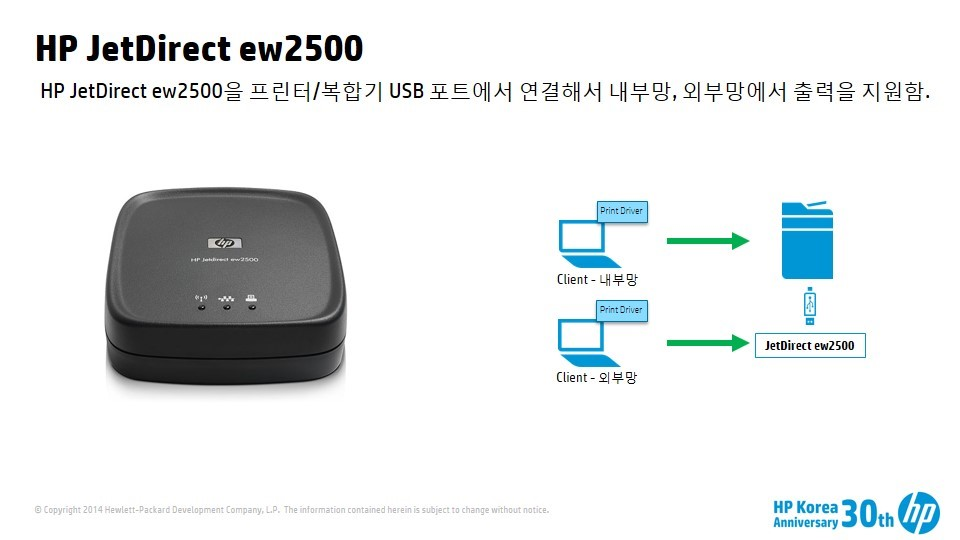
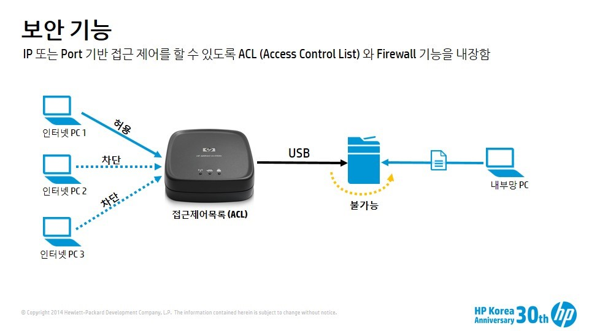

금융권에서는 보안 사고 후에 망을 분리 작업을 수행했거나 진행하고 있다. 망분리를 하는 이유는 사내 인트라넷을 인터넷과 물리적으로 분리함으로써 외부로 부터의 침입과 내부로 부터의 데이터 유출을 원천적으로 막겠다는 의도다. 

망분리를 하게 되면 아무래도 업무상 불편한 것이 한두가지가 아니다. 만약 우리 회사가 망분리를 한다면 회사내에서 인터넷 접속이 안될 것이다. (업무중에 Google 이나 Naver 에 접속이 아예 안된다는 것이다.) 이러한 이유로 업무상 인터넷에 연결이 필요한 경우 PC를 추가로 구매해서 사용하는데 보통 **Thin Client 나 미니 PC 등 사양이 좀 낮고 저렴한 것으로 도입**을 한다. 

어쨋든 망분리는 네트웍 인프라를 변경하면서 추가적인 선공사와 네트웍 장비 추가 등으로 인해서 비용이 무척 많이 들어가는 작업이다.

### 망분리를 하게 되면 프린팅에 어떤 영향을 주는가?
같은 사무실이라도 인터넷, 인트라넷이 완전히 분리되기 때문에 인터넷망과 인트라넷망은 서로 통신이 불가능하다. 즉, 인터넷용 PC, 인트라넷용 PC가 같은 책상에 있고 프린터가 인트라넷에 네트웍으로 연결되어 있다면 인터넷 PC에서는 인쇄가 불가능하다. 이 문제를 어떻게 해결할까?

### 1. 인터넷용 프린터를 추가로 구매한다.
예산이 문제지만 보안을 위해서는 이 방법이 정답이다. PC도 따로 분리했다면 프린터도 당연히 별도로 사용하는 것이 맞다. 그러나, 대부분의 고객이 예산 문제로 다른 대안이 없는지 알고 싶어 한다. 더구나 중앙 집중식으로 1개 층에 대형 복합기 1대, 프린터 1 등으로 Consolidation 을 수행한 MPS(Managed Print Service) 고객의 경우 고민이 될 수 밖에 없다.

### 2. 프린터 USB 포트 활용
프린터에는 네트웍 케이블을 연결할 수 있는 포트와 USB 포트가 같이 있습니다. 인트라넷은 네트웍으로 연결하고 인터넷 PC는 USB로 연결한다. 이방식의 장점은 USB 케이블만 있으면 바로 구현이 가능하다. 그러나, USB 케이블 길이 제한이 있고 인터넷 PC는 1대만 연결이 가능하다는 단점이 있다. 제한적인 환경에는 적용이 가능한 방식이다.

### 3. 외장형 프린트 서버 액세서리 활용
한 대의 프린터에 인터넷 ,인트라넷 네트웍을 연결하는 방식으로 HP JetDirect ew2500 이라는 액세서리를 이용하면 구현할 수 있다. 프린터에 내장된 네트웍 포트에는 인트라넷을 연결하고 HP JetDirect ew2500 의 네트웍 포트에 인터넷 라인을 연결한다. HP JetDirect ew2500과 프린터는 USB 케이블로 연결한다.

이 방식의 **장점**은 

* 대부분의 프린터와 복합기에서 호환이 된다. **그러나, 2015년 봄부터 출시된 기업용 프린터/복합기의 경우 JetDirect 2900nw를 사용해야 한다.**
* 프린터와 JetDirect 간의 연결이 USB이기 때문에 인터넷과 인트라넷과의 브릿징을 통한 침투가 불가능하다.
* JetDirect 내에 ACL(Access Control List), 방화벽(Firewall) 기능이 내장되어 있어서 인터넷 PC IP 주소를 등록해 놓으면 다른 PC에서의 출력을 차단할 수 있다.

이 방식의 **단점**은

* 구매 비용
* 별도의 전원이 필요하다.

### 제품 정보

* 제품명: HP JetDirect ew2500 (J8021A)
* 소비자가격 (부가세 별도):  322,000 원
* 제품 정보 링크: http://www8.hp.com/kr/ko/products/print-servers/product-detail.html?oid=3980828