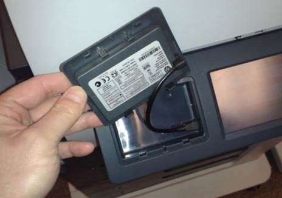

2015년 상반기부터 출시된 엔터프라이즈 프린터/복합기에는 포맷터 내 USB 포트가 없습니다. 내부 USB 포트는 한글 폰트나 솔루션 탑재를 위한 보조 기억 장치 (USB Thumb Drive) 를 장착하기 위한 용도로 사용됩니다.

아래 사진은 M3035mfp 의 내부 USB 포트: 이제 신제품들은 내부 USB 포트를 액세서리로 구매해야 함

고객사에 한글 폰트 솔루션이나 바코드 솔루션 (JetMobile BarDIMM) 과 같은 솔루션을 납품해야 하는 경우 아래 해당 장비일 경우 반드시 같이 오더를 내셔야 합니다.

#### 호환장비

- 레이저젯 엔터프라이즈 M506
- 레이저젯 엔터프라이즈 M604/M605/M606
- 레이저젯 엔터프라이즈 M553
- 레이저젯 엔터프라이즈 복합기 M577
- 페이지 와이드 엔터프라이즈 556, 586

(주) 프로 시리즈는 폰트 솔루션 탑재가 불가능하므로 해당 사항 없음

### HP Internal USB Port (F2A87A): M506, M527 전용

제품번호는 F2A87A 는 M506, M527  용 Internal USB Port 다. 가격은 B5L28A 보다 저렴하게 나왔고 두 액세서리간 차이점은 동봉된 케이블 수가 F2A87A 보다 적다. 때문에 M506, M527 에 내부 USB 포트가 필요한 경우 B5L28A 보다는 F2A87A 를 구매하는 것이 조금이라도 가격을 낮출 수 있다.

### HIP (Hardware Integration Pocket)

HP 엔터프라이즈 프린터, 복합기에 **"사원증 리더"**나 **무선 젯다이렉트 옵션 (JetDirect 2800)** 을 장착하기 위한 포켓입니다.

포켓 내부에는 마이크로 USB 포트가 있어서 쉽게 이러한 액세서리를 설치할 수 있도록 되어 있습니다.

### HIP2

2015년 상반기부터 출시된 엔터프라이즈 프린터, 복합기의 제품 크기가 소형화됨에 따라서 HIP 도 크기가 작아졌습니다. 어떤 제품이 HIP2인지 구분하는 방법은 간단합니다. 제품 색상이 흰색이면 HIP2입니다. 과거의 HIP을 HIP1이라고 부릅니다.

#### 해당장비

- 레이저젯 엔터프라이즈 M604/M605/M606
- 레이저젯 엔터프라이즈 M552/M553
- 레이저젯 엔터프라이즈 복합기 M527, M577
- 페이지 와이드 엔터프라이즈 556, 586
- 그리고, 앞으로 출시되는 엔터프라이즈 프린터, 복합기

HIP2 로 변경되면서 HIP1용으로 제작된 기존 Common Card Reader (CZ208A) 는 특수한 플라스틱 가이드(액세서리 아님)가 있어야 장착이 가능하게 되었습니다. (HIP2 전용 Common Card Reader 출시 전까지)

HP Access Control 을 제안하는 경우에는 크게 신경 쓸 것이 없습니다. Common Card Reader 을 오더 내면 위의 가이드가 같이 동봉되어서 오기 때문이고 앞으로 HIP1, HIP2 에 대한 부분도 HP Access Control 을 오더 시 제품에 따라서 알아서 제품번호가 선택되어서 진행되기 때문에 문제가 없습니다.

문제가 될 수 있는 상황은 3rd Party 솔루션 (EPSoft EasyReport) 이 납품되는 경우와 채널을 통해서 HP Access Control 을 제안하고 판매하는 경우인데 이미 EPSoft와도 내용이 공유되었기 때문에 추후 딜을 진행하는데 큰 문제는 없을 것으로 생각됩니다.

HP Common Card Reader HIP2 용은 2016년 하반기에 출시 예정입니다.

#### [중요] M506dn, M506x 모델에 HP Common Card Reader 를 제안하는 경우에는 반드시 HP Internal USB Port (F2A87A) 를 같이 오더를 해야 함

M506dn, M506x 모델은 HIP2 포켓의 USB에 전원 공급이 안됩니다. 아래 사진과 같이 메인 보드와 HIP2 포켓 사이에 USB 연결이 안되어 있습니다. (솔직히 저도 왜 이렇게 만들었는지 정확한 이유를 모릅니다.) 때문에 HP Common Card 리더를 장착해도 전원 공급이 안되어서 사용을 못합니다.  HP Internal USB Port (F2A87A) 액세서리를 장착해야만 전원 공급이 됩니다.

HP Internal USB Port (F2A87A) 를 장착해야만 메인보드에서 전원 공급을 받음

- M506n은 HIP2포켓이 없음
- M527 복합기는  HP Internal USB Port (F2A87A) 필요 없이 HIP2로 전원 공급을 함

