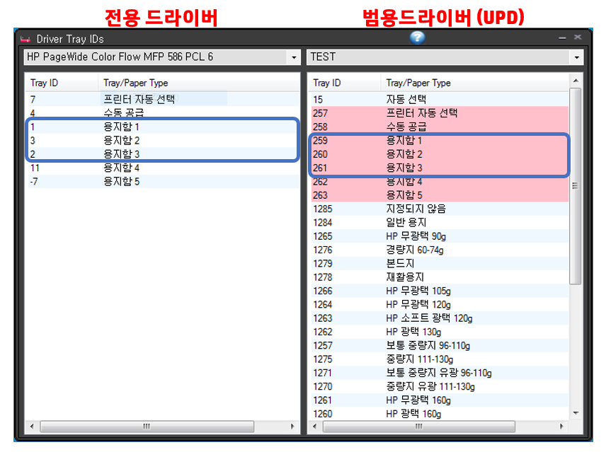

## 용지함 제어가 필요한 이유
출력 소프트웨어에서 인쇄시 프린터 드라이버의 Tray 제어를 할 때 사용되는 Tray Id 정보에 대한 정보를 요약하기 전에 용지함 제어에 대한 사전 배경에 대해서 설명을 먼저 하겠습니다.

일반적인 경우 인쇄시 용지함은 사용자가 프린터 드라이버에서 선택할 수 있습니다. 그러나, 특수한 용도로 개발된 인쇄 프로그램에서는 용지함 선택을 사용자가 하지 않고 인쇄를 누르면 알아서 용지함이 선택되어서 인쇄되는 방식을 사용합니다. 대표적인 경우가 보험사에서 보험 설계사들이 청약서나 보험 증권 등을 인쇄하는 소프트웨어가 이러한 방식을 사용합니다. 

프린터의 급지함이 2개 (상단, 하단)에 상단에는 일반 용지, 하단에는 워터마크가 인쇄된 특수 용지를 넣고 사용하는 경우가 있는데 이러한 경우에 용지함 제어가 필요합니다. 보험 설계사가 프린터 드라이버에서 인쇄할 때 마다 문서 종류에 따라 일일히 용지함을 선택해서 출력한다면 생산성 문제도 있겠지만 실수로 인해서 잘못 인쇄를 한 경우 재인쇄로 인한 비용, 시간 등의 여러 가지 문제가 발생합니다.

그래서, 출력하는 소프트웨어 자체에서 인쇄시 플래너가 출력하고자 하는 문서가 어떤 용지함을 사용하는지 사전에 설정을 해 놓고 인쇄를 누르면 해당 용지함으로 인쇄가 나가도록 만들어져 있습니다. 사용자는 인쇄시 옵션에 대해서 신경 쓸 필요가 없습니다. 이 때 개발자가 필요로 하는 정보가 Tray Id 입니다.

## HP 프린터 Tray Id 정보

제조사, 드라이버 별로 Tray Id 는 같지 않습니다. HP의 경우 기종에 관계 없이 동일한 Tray Id를 사용합니다만 2015년 상반기부터 출시된 제품부터 드라이버 구조가 변경되면서 Tray Id가 변경되었습니다. 만약 고객사에서 Tray 제어용으로 Tray Id를 요구하는 경우에 아래 정보를 제공하면 됩니다. 쉽게 구분하는 방법은 UPD (범용 드라이버), 모델 드라이버 2가지 케이스가 있기 때문에 아래 2가지 중 하나입니다.

## 주의 사항
HP 장비는 타사와 Tray 넘버링이 다름

- Tray 1: 수동
- Tray 2: 기본
- Tray 3: 추가

프린트 드라이버의 Tray Id는 변경 못함 (하드 코딩), 즉, 프린팅 하는 어플리케이션에서 제조사 및 드라이버에 맞는 Tray Id를 사용해야 정확히 Tray 제어가 됩니다. 쉽게 말해서 프린터 드라이버를 고쳐서 Tray Id를 변경할 수 없고 출력 소프트웨어에서 변경을 해야 합니다.
