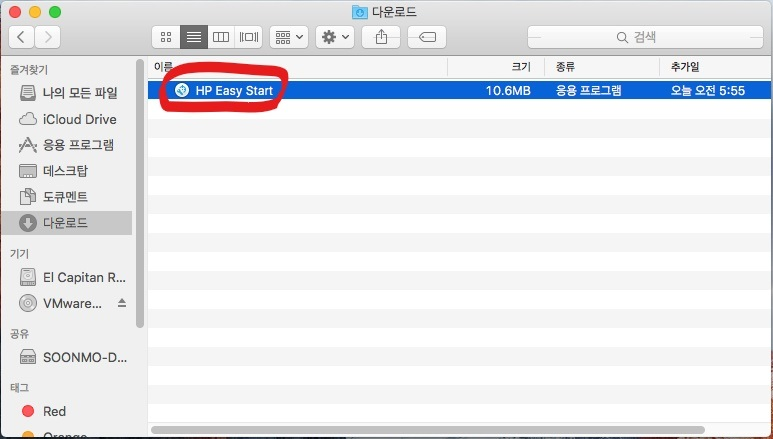
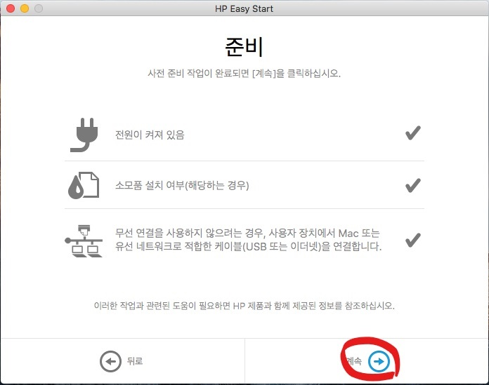
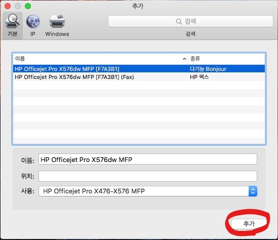
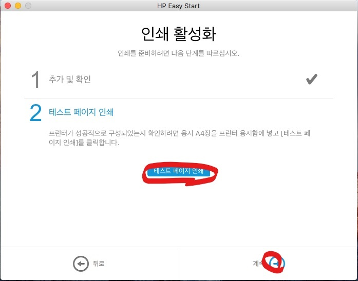
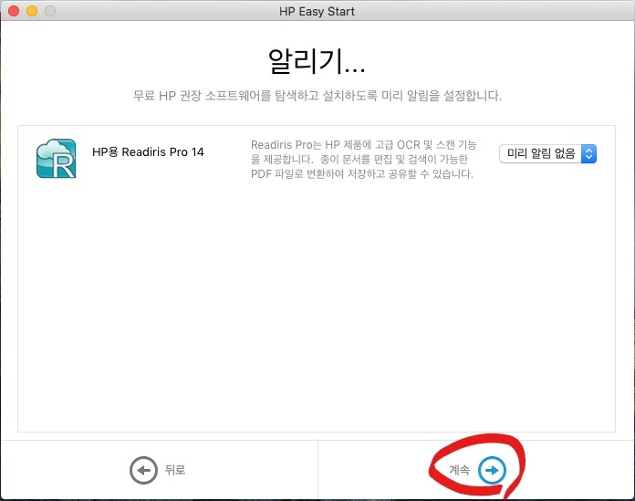

일반 기업에서는 Windows 환경이 대부분이지만 요즘 iMac 이나 MacBook 사용자들이 많이 늘어났다. 간혹 HP 프린터가 Mac 용 드라이버를 지원하는지 질문을 받는 경우가 있다. HP가 미국이 주요 매출원이고 미국에는 특히 Apple 의 시장 점유율이 매우 높다. 그러므로, 당연히 Mac 환경을 아주 잘 지원한다.

아래 과정은 HP OfficeJet Pro X576 mfp 제품으로 테스트했지만 모델이 다르더라도 거의 유사한 과정으로 프린터를 설치할 수 있을 것이다.

#### 드라이버 다운로드
HP.COM 에서 프린터 모델과 Mac OS X 버전에 맞는 드라이버를 다운로드 한다. 실제로는 드라이버가 아니라 **"HP Easy Start"** 라고 하는 소프트웨어이다. 인터넷에서 사용중인 모델에 맞는 드라이버와 소프트웨어를 다운로드하고 설치를 도와주는 소프트웨어이다. 때문에 반드시 인터넷 연결이 되어 있어야 한다.

#### **"HP Easy Start"**를 더블 클릭

#### 내 HP 제품 설정 앞의 화살표 클릭

#### **"계속"** 클릭

#### **"계속"** 클릭

#### 네트웍에 연결되어 있는 프린터들이 나타나면 설치를 워하는 기종을 선택 후 **"계속"** 클릭

#### 약관 동의하고 **"계속"** 클릭

#### **"활성화하지 않고 건너뛰기"** 클릭

#### **"설치"** 클릭

#### 암호 입력 후 **"승인"** 클릭

#### 이제 자동으로 소프트웨어가 다운로드되고 설치된다. 설치가 끝나면 **"계속"**클릭 

#### **"계속"** 클릭

#### **"프린터 추가"** 클릭

#### **"추가"** 클릭

#### **"테스트 페이지 인쇄"**를 클릭해서 프린터에서 테스트 페이지가 출력되는지 확인 후 **"계속"** 클릭

#### OCR 소프트웨어가 필요 없다면 **"계속"** 클릭

#### **"완료"**를 클릭해서 설치를 끝낸다.

