### Feature Packs 이란?
Feature Packs 는 Web JetAdmin 10.3 SR8 이후에 추가된 기능으로 WJA을 새로 설치하지 않고 신제품 프린터, 복합기의 새로운 구성 옵션을 WJA에 동적으로 추가할 수 있도록 한다.  예를 들어서 신제품 A의 내장 웹서버(EWS)에 WiFi Direct 기능을 On, Off 할 수 있는 항목이 있는데 현재 버전의 WJA에 없는 경우에 WJA 10.8 SR8 이전에는 WJA 를 최신 버전으로 업그래이드를 해야 했었다. 그러나, 지금은 Feature Packs 만 설치하면 신제품에 대한 구성이 가능해 진다.

각각의 Feature Packs은 최소의 WJA 버전 요구사항이 있기 때문에 설치전에 이를 미리 확인해야 한다. 최소 버전 요구 사항이 맞지 않은 경우에는 설치시 최소 버전 요구 사항에 대한 안내 메시지가 뜨고 설치가 안된다.

**주의!**
Feature Packs 이 일단 설치되면 WJA으로 부터 제거가 불가능하다. 만일을 위해서 Feature Packs 적용 전에 WJA 백업 수행을 권장함

### Feature Packs 구하기
[HP Web JetAdmin 공식 웹사이트](http://hp.com/go/webjetadmin) 에서 Feature Packs 를 다운로드 한다.

##### 1."Download now" 클릭
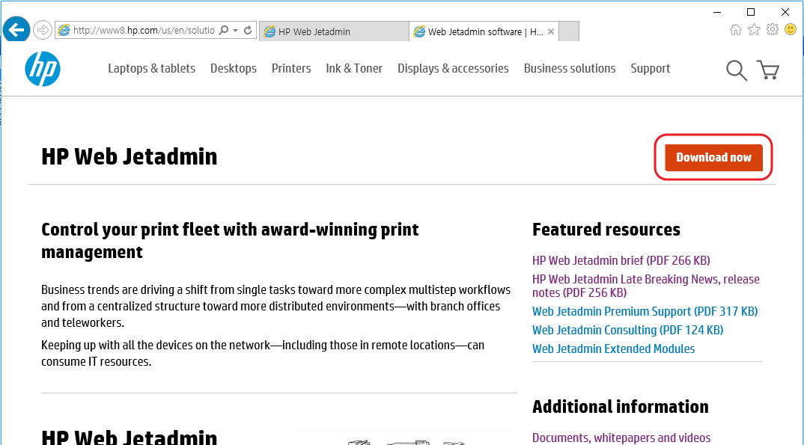

##### 2. "Select" 클릭
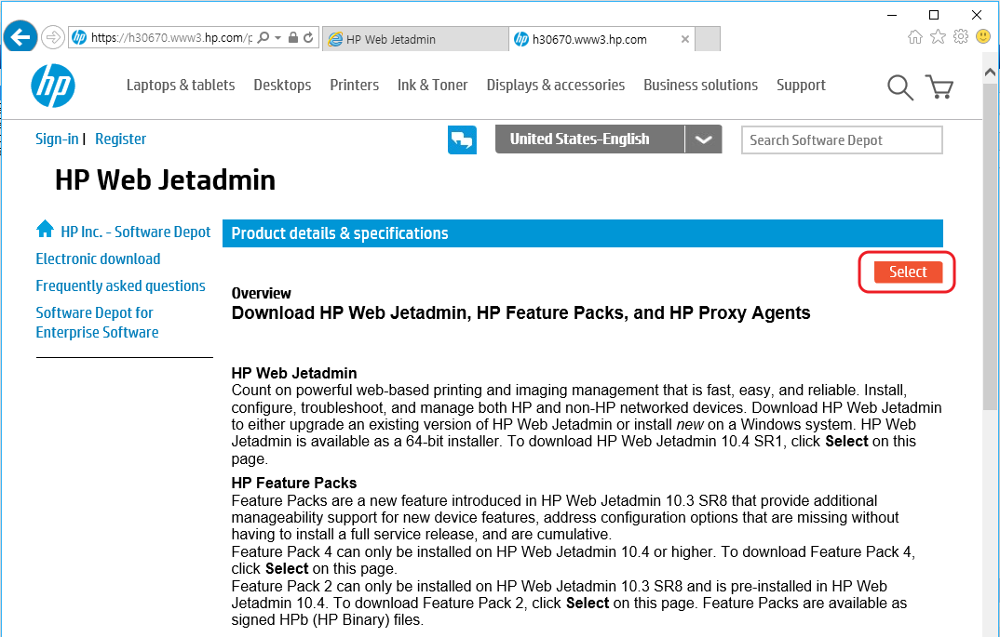

##### 3.HP Passport 로 로그인 (무료이니 계정이 없으면 만든다)
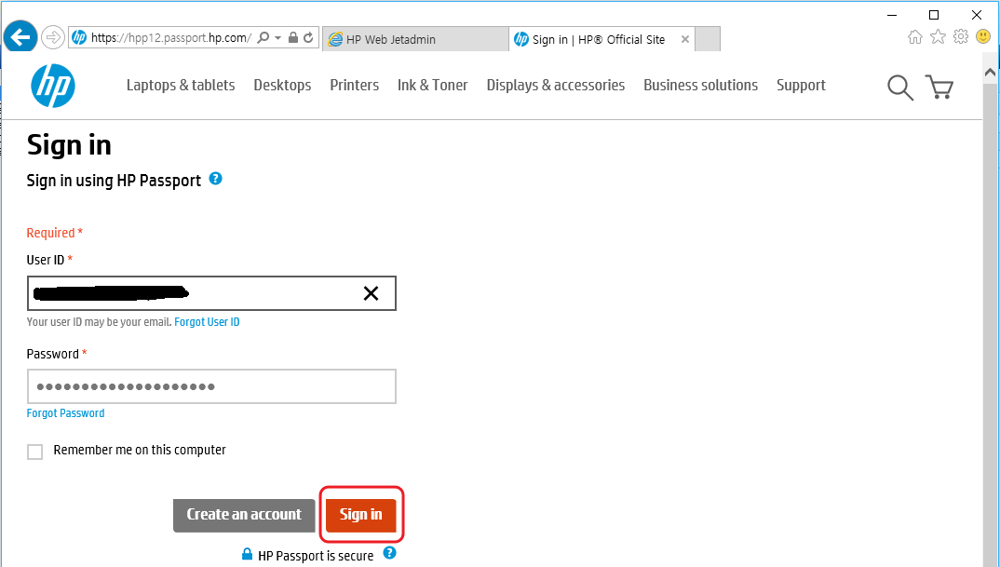

##### 4.전화 번호, 설문에 적당히 응답하고 "Next" 클릭
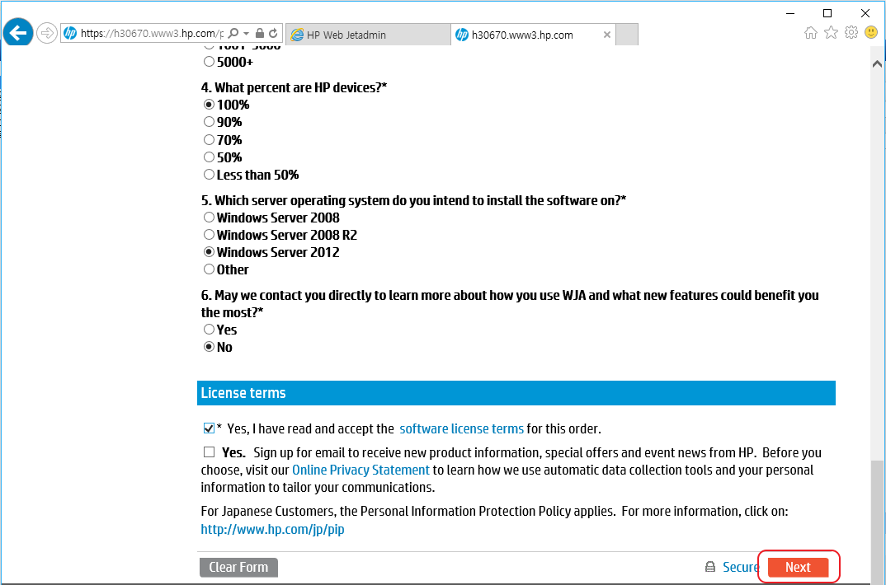

##### 5.Feature Pack 우측의 "Download" 클릭 
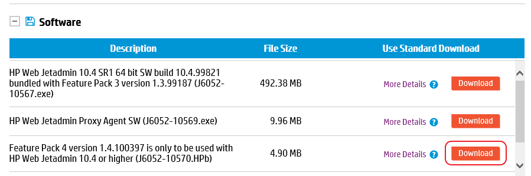

### Feature Pack 설치

##### 1. WJA 메인 메뉴인 "도구" - "기능 팩..." 클릭
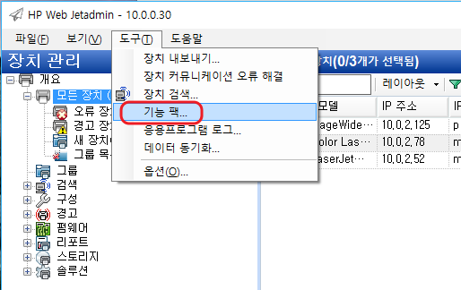

##### 2. "가져오기" 클릭
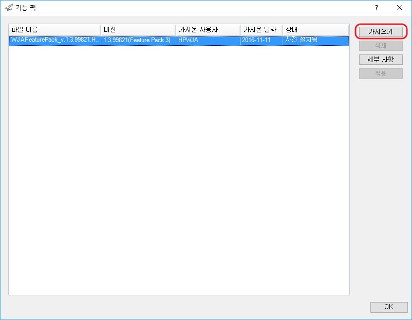

##### 3. 다운로드 한 Feature Packs 파일 (확장자가 HPB)을 선택 후 "열기" 클릭
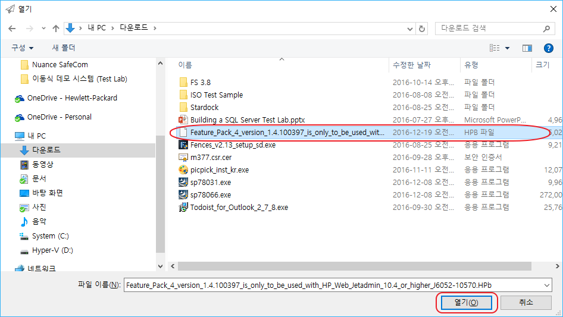

##### 4. "확인" 클릭
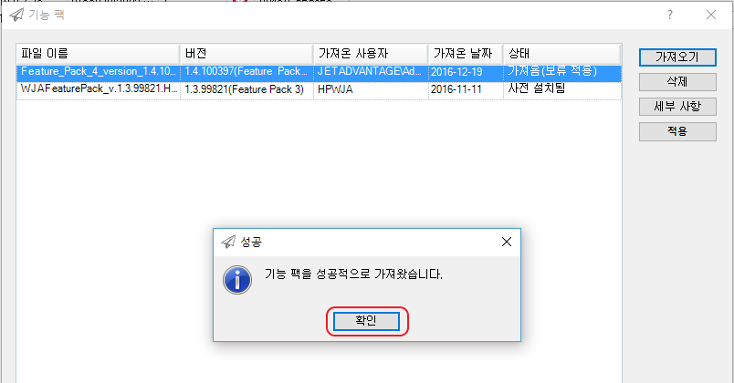

##### 5. Feature Packs 을 선택 후 "적용" 클릭
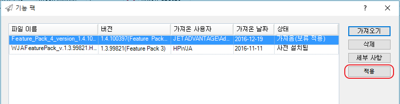

##### 6. "확인" 클릭
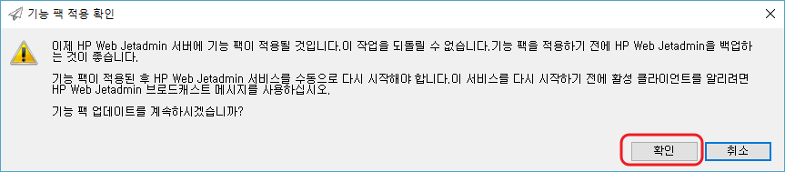

##### 7. "확인" 클릭
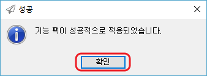

##### 8. "OK" 클릭
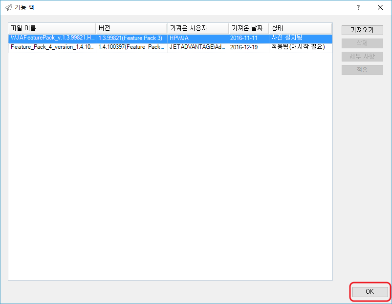

##### 9. "HPWJA" 서비스를 재시작한다. (services.msc 실행)
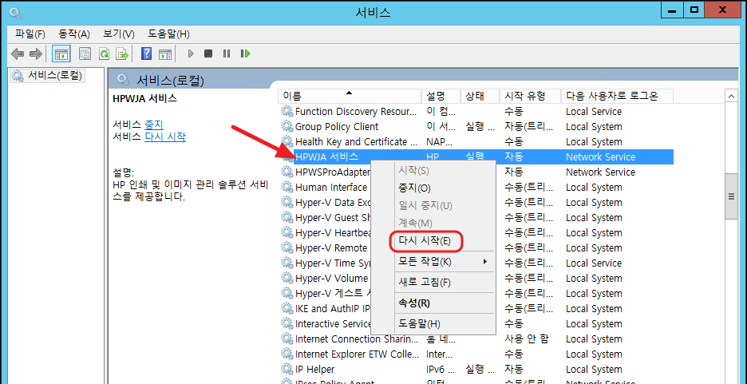

##### 10. WJA 메인 메뉴인 "도구" - "기능 팩..." 클릭 후 Feature Pack 이 적용됨으로 되어 있는지 확인
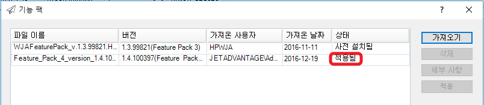