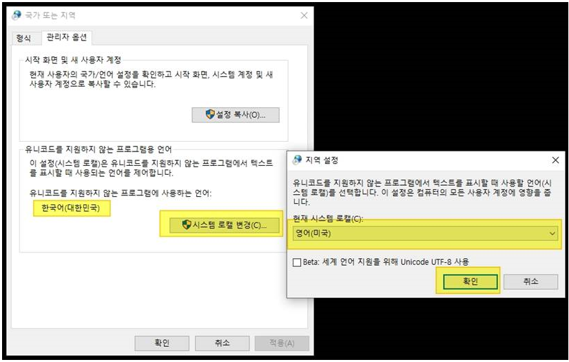

## 증상

레이저젯 엔터프라이즈 프린터/복합기 사용량 데이터 수집을 진행하면 데이터 수집이 안되고 **"장치 변경 오류"** 가 발생함, 레이저젯 프로 제품군은 정상적으로 수집됨

## 해결 방법

Web JetAdmin 을 설치한 PC 또는 서버에서 다음 작업을 진행합니다.

1. OS 설정 변경 (로케일 등): 제어판의 "국가 또는 지역" 에서 아래 두 가지 설정 변경

2. 재부팅

3. 오류가 발생한 프린터/복합기를 삭제 후 다시 추가

4. 데이터 수집에서 장치 추가

