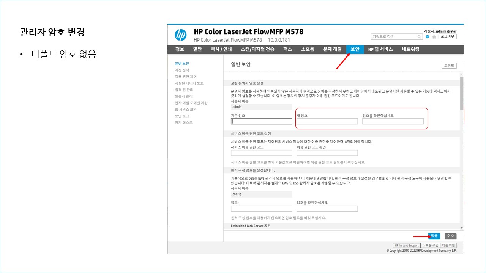
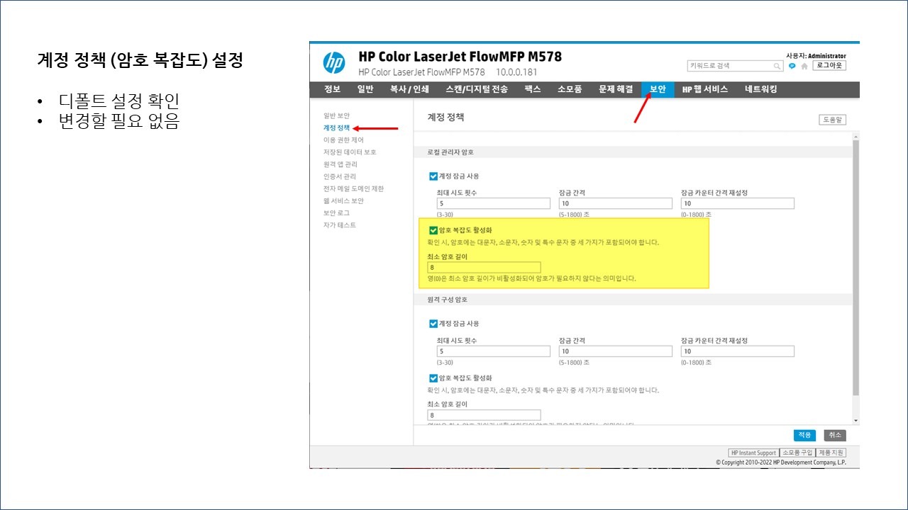
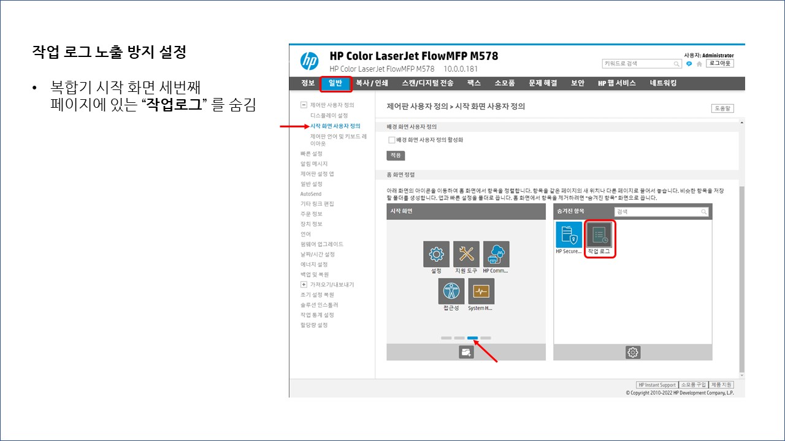
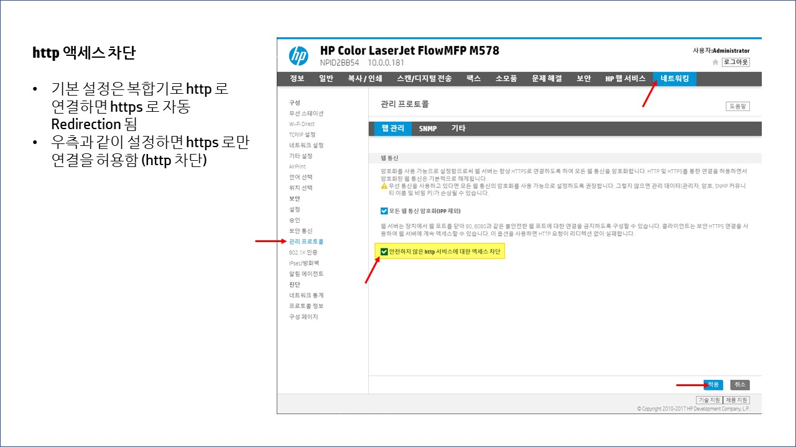
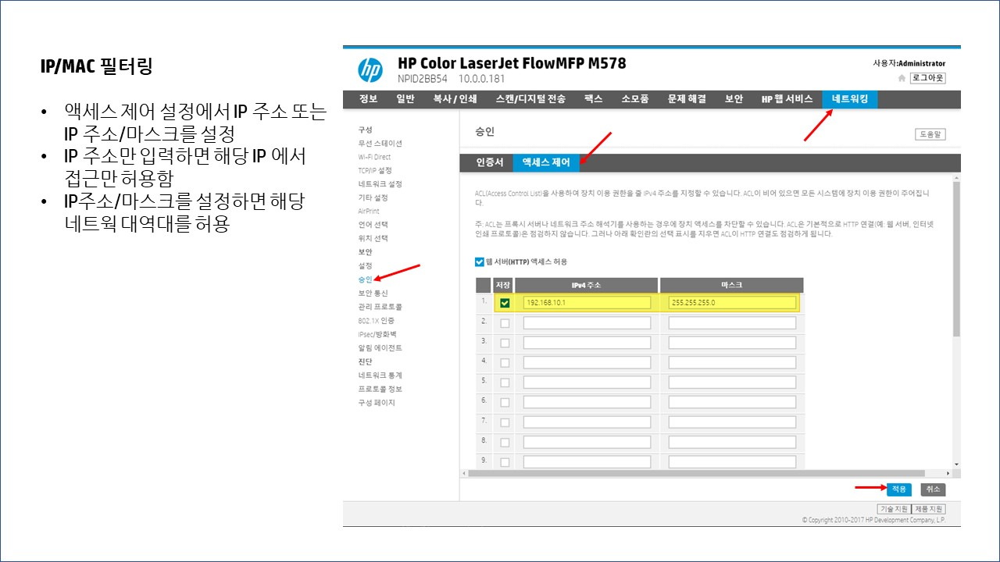

## 프린터/MFP 보안 요구 사항

* 웹 인터페이스 관리자 페이지 암호 설정
* 암호는 영문, 숫자, 특수문자 중 2종류 이상을 조합하요 최소 10 자리 이상 또는 3 종류 이상을 조합하여 최소 8자리 이상의 길이로 구성
* 출력 기록 / 스캔 파일 /복사 수발신 기록 비활성, 또는 노출 금지, 또는 노출 기간 최소화
* https 443 사용, http 80 비활성
* IP/MAC 필터링 > 사용자 또는 부서 IP 대역 설정

## 프린터/MFP 보안 설정 (HP 레이저젯 엔터프라이즈)

EWS에 접속해서 관리자 암호 설정

기본적으로 암호 복잡도가 설정되어 있어서 단순한 암호로는 설정이 안됨

인쇄 작업 로그를 노출하지 않도록 홈스크린 설정을 변경함

https 로만 접속이 가능하도록 함

ACL (Access Contrkl List) 설정
