# <u>HP FutureSmart 기반 프린터/MFP 의 HDD, SSD, eMMC 보안</u>

## 개요
이 문서에서는 HP FutureSmart가 탑재된 제품의 보안 지우기 옵션과 하드 디스크, SSD 및 eMMC 보안에 대해 설명합니다. 

## HDD 보안 개요
하드 디스크 드라이브를 사용하는 기기에서 고객 데이터를 보호하기 위해서 모든 기록되는 데이터 영역은 AES-128 또는 AES-256 을 사용해서 암호화 됩니다. (2012년 11월 이후 생산된 제품들). 전제 디스크를 삭제(작업  데이터 삭제 참조)하는 대신에 필요시 작업 데이터가 포함된 디스크 영역만 완전하게 삭제될 수 있습니다. 전체 디스크를 삭제하는 업계 표준 ATA 보안 삭제 (ATA Secure Erase)도 사용할 수 있습니다. (디스크 완전 삭제)

## HDD 아키텍쳐
프린팅 장치의 하드 디스크는 데이터를 구분하기 위해서 몇 개의 다른 섹션으로 나눠져 있습니다.

* <u>작업 데이터 (Job Data)</u>: 임시파일(인쇄/스캔 작업)과 저장된 작업을 포함하는 모든 작업 데이터 포함

* <u>구성 데이터 (Configuration Data)</u>: 인쇄 장치 관련 설정과 시스템 정보를 포함합니다. 인쇄 기본 설정, 인증 설정 및 일부 고객별 구성 설정이 포함됩니다. 

* <u>시스템 데이터 (System Data)</u>: HP FutureSmart 펌웨어 운영 시스템 코드가 포함되어 있습니다. 인쇄 장치를 부팅하려면 이 코드가 하드 디스크에 있어야 합니다. 이전 HP 인쇄 장치 운영 체제는 비휘발성 메모리에 저장된 압축 이미지에서 부팅되었습니다.

* <u>저장소 (Repository)</u>: 이 영역에는 손상된 운영 체제 이미지를 복원하거나 실패한 펌웨어 업그래이드를 복구하는 방법을 제공하는 장치 운영 체제 설치 코드의 압축 복사본이 포함되어 있습니다.

## 보안 삭제 명령
HP FutureSmart 펌웨어 인쇄 장치는 운영중인 장치의 작업 데이터를 완전하게 삭제하고 장치 폐기 또는 재배포를 위해 4가지 다른 데이터 지우기 기능을 지원합니다.

### 1.임시 작업 파일 관리 (Managing Temporary Job Files) 
이 기능은 인쇄, 복사, 팩스 또는 디지털 전송 작업 완료 시 임시 작업 파일을 지우는 방법을 제어합니다.

임시 작업 파일에는 다음이 포함됩니다.

* 인쇄 작업을 위한 임시 데이터
* 복사, 팩스, 이메일 및 네트워크 폴더로 저장 작업에 대한 임시 데이터   
    
사용 가능한 파일 지우기 모드는 다음과 같습니다.
* 비보안 고속 지우기 (덮어쓰기 없음)
* Secure Fast Erase (덮어쓰기 1회)
* Secure Sanitizing Erase (덮어쓰기 3회)
    
<u>참고</u>: 파일 지우기 모드 사양은 부록 A를 참조하세요.

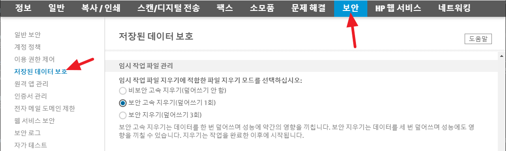
그림 1: 내장 웹서버(EWS) 내의 임시 작업 파일 관리 설정

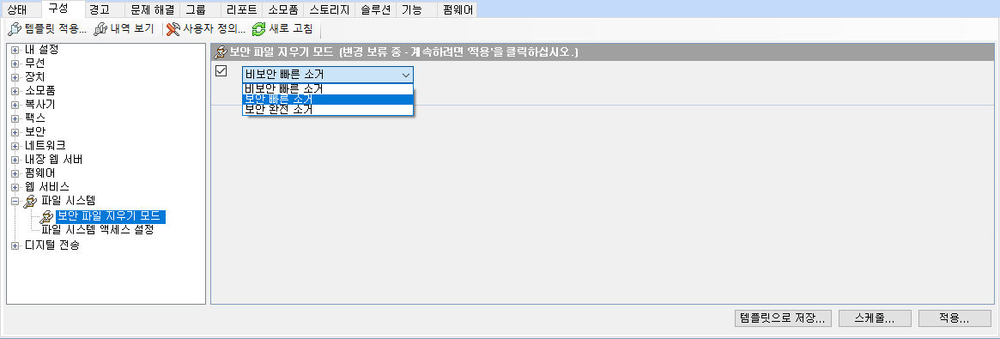
그림 2: 웹젯어드민 내의 보안 파일 지우기 모드 설정
<u>참고</u>: 이 설정은 내장 웹서버(EWS)의 임시 작업 파일 관리 설정에 해당됨

### 2.작업 데이터 삭제 (Erase Job Data)  
이 기능은 다음을 포함하여 디스크에 저장된 모든 작업 데이터 파일을 지우고 덮어씁니다.

* 인쇄 작업을 위한 임시 데이터
* 복사, 팩스, 이메일 및 네트워크 폴더로 전송 작업을 위한 임시 데이터
* 저장된 작업, 저장된 팩스 작업

사용 가능한 파일 지우기 모드는 다음과 같습니다.

* 비보안 빠른 지우기 (덮어쓰기 없음)
* Secure Fast Erase (덮어쓰기 1회)
* Secure Sanitizing Erase (덮어쓰기 3회)

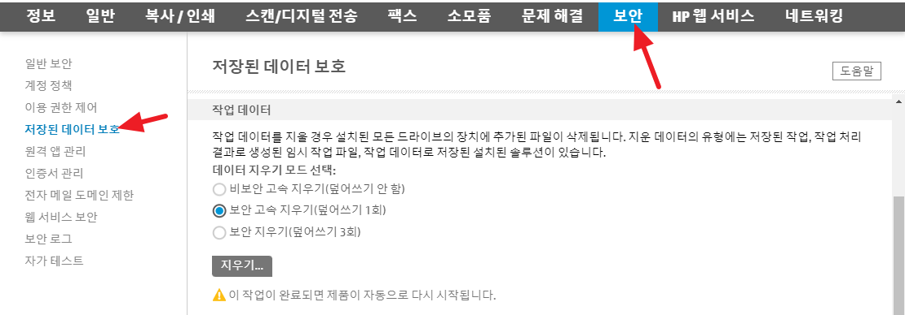
그림 3: 내장 웹서버(EWS) 내의 작업 데이터 삭제 설정

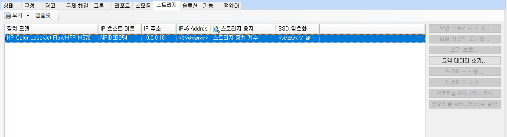
그림 4: 웹젯어드민 내의 고객 데이터 소거 설정
<u>참고</u>: 이 설정은 내장 웹서버(EWS)의 작업 데이터 삭제 설정에 해당됨

### 3. 보안 디스크 삭제 (Secure Disk Erase)  
이 기능은 스페어 섹터 및 재배치된 섹터를 포함하여 하드 디스크의 모든 데이터를 안전하게 지웁니다. ATA 삭제라고도 하는 이 지우기 작업은 하드 디스크 컨트롤러에서 직접 실행됩니다. 

보안 디스크 삭제는 미국립표준원 (NIST) 특별 간행물 800-88, 미디어 삭제 지침에 정의된 "제거(Purge)" 삭제 표준을 충족합니다. (정부 삭제 사양 참조) 이 삭제 모드는 기본 시스템 디스크의 사전 부팅 메뉴에서만 수행할 수 있습니다. EWS 및 Web Jetadmin의 액세서리 디스크 메뉴에서 수행할 수 있습니다. 지워진 디스크에 시스템 펌웨어가 포함된 경우 지우기/잠금 해제를 수행하면 장치가 작동하지 않게 되며 장치를 다시 사용하려면 디스크에 새 펌웨어 이미지를 설치해야 합니다.

  
그림 5: 사전 부트 메뉴의 Secure Erase

### 4.암호화된 디스크 지우기/잠금 해제 (Erase/Unlock Encrypted Disk)  
HP 고성능 보안 하드 디스크는 "암호화 삭제 (Crypto Erase)"라고 하는 삭제를 지원합니다. 이러한 디스크 중 하나에 대해 지우기/잠금 해제 옵션을 선택하면 암호화 키가 강제로 삭제되고 새 키가 생성됩니다. 이렇게 하면 디스크의 모든 암호화된 데이터를 즉시 읽을 수 없게 됩니다. 암호화 키를 복구할 수 있는 방법이 없으며 키가 변경된 후에는 암호화된 데이터를 복구할 수 있는 방법이 없습니다.

이 삭제 모드는 기본 시스템 디스크의 사전 부팅 메뉴에서만 사용할 수 있습니다. EWS 및 Web Jetadmin의 보조 디스크에 사용할 수 있습니다. 지워진 디스크에 시스템 펌웨어가 포함된 경우 지우기/잠금 해제를 수행하면 장치가 작동하지 않게 되며 장치를 다시 사용하려면 디스크에 새 펌웨어 이미지를 설치해야 합니다.

  
그림 6: 사전 부트 메뉴의 Erase / Unlock

## 디스크 초기화 명령 (Disk Initialization Commands)
이러한 명령은 문제 해결 및 진단 기능을 제공하기 위해 하드 디스크 또는 디스크 섹션을 다시 초기화합니다. 이 명령은 디스크 포맷 명령과 유사하며 섹터 수준 데이터 덮어쓰기를 제공하지 않습니다. 이러한 삭제 명령은 고객 데이터를 안전하게 제거하기 위해 권장되지 않습니다.

이러한 명령은 장치 사전 부팅 메뉴에서만 수행할 수 있습니다.

* <u>Clean Disk</u> 는 디스크에서 모든 데이터를 제거합니다. 이 명령은 장치를 작동 불가능하게 만듭니다. 장치를 다시 사용하려면 장치 펌웨어를 디스크에 다시 설치해야 합니다.

  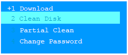  
그림 7: 사전 부트 메뉴의 Clean Disk

* <u>Partial Clean</u> 는 저장소의 압축된 운영 체제 설치 코드를 제외하고 디스크에서 모든 데이터를 제거하고 장치 운영 체제의 다시 로드를 시작합니다.

  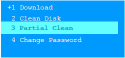  
그림 6: 사전 부트 메뉴의 Partial Clean

## SSD 및 eMMC 보안 개요

HP 인쇄 장치의 일부 모델은 SSD(Solid State Drive) 또는 eMMC(embedded MultiMediaCard) 대용량 저장 장치를 시스템 디스크로 사용합니다(이러한 모델의 경우 부록 C 참조). SSD와 eMMC는 기존 HDD(하드디스크드라이브)에서 사용하던 회전형 디스크 대신 낸드 플래시 메모리를 사용하는 대용량 저장장치입니다. 이러한 메모리 기반 드라이브는 인쇄 장치 운영 체제에 기존 하드 디스크 드라이브로 표시됩니다.

SSD 및 eMMC에는 기존 HDD 지원 장치에서 사용할 수 있는 일부 보안 기능에 영향을 주는 작동 특성이 있습니다. 높은 보안 환경 및 보안에 민감한 응용 프로그램의 경우 HP는 다음을 권장합니다.
* HDD가 포함된 모델 선택(부록 B 장치 목록 참조)
* 지원되는 경우 HDD(옵션) 추가(작업 데이터에 대한 액세서리 드라이브 옵션 참조)

## SSD/eMMC에서 보안 삭제 데이터 덮어쓰기 (Secure Erase Data Overwrite) 기능이 지원되지 않음

플래시 메모리 작동의 특성상 SSD와 eMMC는 하드 디스크 드라이브처럼 데이터를 직접 덮어써 안전하게 파일을 삭제할 수 없습니다. 다음 SSD 및 eMMC 읽기/쓰기 특성은 파일을 지속적으로 안전하게 삭제하기 위해 Secure Fast Erase(1-pass) 또는 Secure Sanitize Erase(3-pass) 알고리즘을 사용하는 HP의 Secure Erase Data Overwrite 기능 구현을 방지합니다.

* SSD 및 eMMC 컨트롤러는 "웨어 레벨링"이라는 기술을 사용하여 SSD의 모든 플래시 블록에 데이터를 고르게 배포합니다. 이로 인해 새 데이터를 쓸 때 이전에 기록된 데이터가 다른 위치로 동적으로 이동됩니다. 덮어쓰기를 위해 이전 데이터 위치를 추적할 수 없습니다.
* SSD 및 eMMC "쓰기 증폭" 동작은 또한 메모리 컨트롤러가 이전에 기록된 데이터를 동적으로 재배치하도록 합니다. 데이터는 4~8KB 페이지를 사용하여 플래시 위치에 기록되지만 일반적으로 256KB 블록에서 지워야 합니다. 플래시를 다시 쓰기 전에 지워야 하므로 기존 데이터는 삭제를 위해 전체 블록을 해제하기 위해 재배치됩니다.

## SSD 및 eMMC를 통한 보안 휘발성 스토리지 기능

SSD 및 eMMC를 사용하는 장치의 고객 데이터를 보호하기 위해 HP는 고객 작업 데이터가 포함된 스토리지 장치의 특정 영역에 펌웨어 암호화를 사용합니다. 고객 작업 데이터 디스크 영역에 기록된 모든 파일은 AES-128 암호화를 사용하여 암호화됩니다. 원하는 경우 AES-256 암호화로 구성할 수 있습니다(그림 9).

암호화된 파티션에 저장된 데이터에는 저장된 인쇄 작업, 임시 인쇄 작업 파일, 다운로드한 글꼴을 포함한 PJL 및 PostScript 파일 시스템 파일, 확장성 고객 데이터(확장성 솔루션에 의해 저장된 경우)가 포함됩니다.

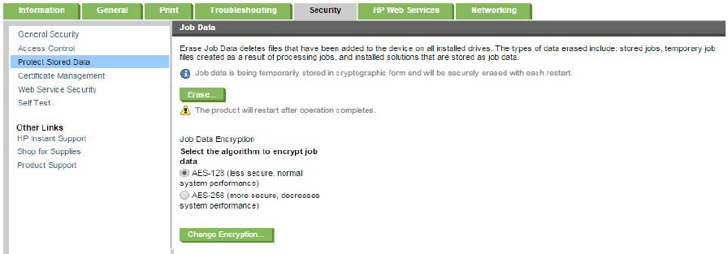  
그림 9: 내장 웹서버(EWS) 내 SSD또는 eMMC 시스템 디스크의 작업 데이터 암호화 관리

**참고**: SSD 및 eMMC 제품 메모리에는 온보드 암호화가 없기 때문에 "상태: 디스크를 암호화할 수 없음"으로 나열됩니다(그림 10). 그러나 메모리에 기록된 모든 데이터는 그림 9와 같이 구성된 장치 펌웨어에 의해 암호화됩니다.

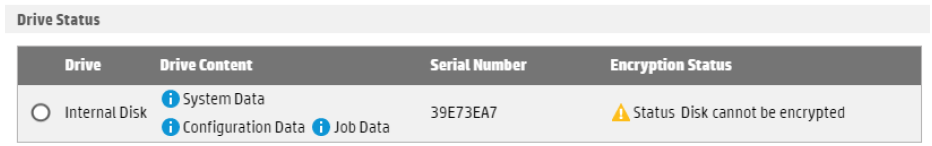  
그림 10: 내장 웹서버(EWS)에서는 디스크가 암호화되어 있지 않다고 표시됨

하드 디스크 드라이브가 없는 장치의 경우 고객 데이터 파티션이 재구축되고 암호화 키가 보존되지 않기 때문에 시스템 전원이 꺼졌다가 켜질 때 암호화된 데이터가 암호화 방식으로 지워집니다. 이를 통해 SSD 또는 eMMC의 암호화된 섹션에서 모든 고객 데이터를 안전하게 지울 수 있습니다.

## SSD 및 eMMC가 디스크 관리 기능에 미치는 영향

SSD를 장치 시스템 디스크로 사용하면 다음 보안 기능이 영향을 받습니다.

### 1.임시 작업 파일 관리
이 기능은 인쇄, 복사, 팩스 또는 디지털 전송 작업 완료 시 임시 작업 파일을 지우는 방법을 제어합니다.

SSD 및 eMMC 장치는 다음 지우기 모드를 지원하지 않습니다.
* Secure Fast Erase(덮어쓰기 1회)
* Secure Sanitizing Erase (덮어쓰기 3회)

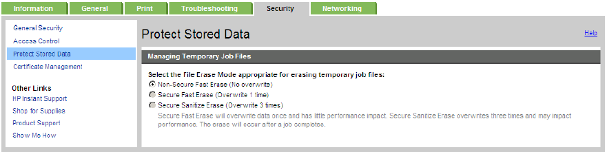  
그림 11: SSD 또는 eMMC 시스템 디스크를 사용하는 경우 내장 웹서버(EWS) 내의 임시 작업 파일 관리 설정

### 2.작업 데이터 지우기
이 기능은 인쇄, 복사, 팩스, 이메일 및 네트워크 폴더로 스캔 작업, 저장된 작업 및 저장된 팩스 작업에 대한 임시 데이터를 포함하여 시스템 디스크에 저장된 모든 작업 데이터 파일을 지웁니다. SSD 및 eMMC 장치는 다음 지우기 모드를 지원하지 않습니다:

* Secure Fast Erase(덮어쓰기 1회)
* Secure Sanitizing Erase (덮어쓰기 3회)

### 3.작업(Job) 데이터 암호화
작업 데이터는 일시적으로 암호화 형식으로 저장되며 재부팅 때마다 안전하게 지워집니다. 기본 설정은 최상의 시스템 성능을 제공하는 AES-128입니다. AES-256은 더 많은 보안을 제공하지만 시스템 성능에 영향을 미칩니다.

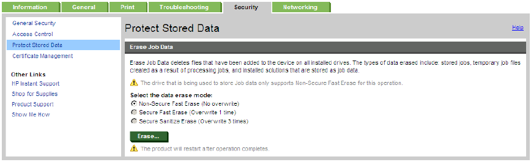  
그림 12: SSD 또는 eMMC 시스템 디스크를 사용하는 경우 내장 웹서버(EWS) 내의 임 작업 데이터 암호화 설정

### 4.보안 지우기
HP 인쇄 장치에 사용되는 SSD가 있는 HP 인쇄 장치는 ATA 보안 삭제 (ATA Secure Erase)를 지원하여 주소 지정 가능 및 예비 스토리지를 모두 지웁니다. 이 삭제는 퍼지(Purge)에 대한 NIST 800-88r1 표준을 충족합니다. (미국 정부 삭제 기준 참조)

**참고**: HP 인쇄 장치에 사용된 SSD의 초기 세대는 ATA 보안 지우기를 지원하지 않았습니다. 그러나 Secure Erase 명령을 실행하면 모든 셀을 비어 있는 것으로 표시하는 주소 지정 가능한 모든 메모리 위치가 수동으로 지워집니다. (ATA 삭제를 지원하지 않는 장치에 대해서는 부록 D를 참조하십시오.)

eMMC가 있는 HP 인쇄 장치는 보안 삭제를 지원합니다. HP 인쇄 장치에 사용되는 eMMC는 ATA Secure Erase를 지원하지 않지만 대신 Trim with Sanitize를 사용하여 주소 지정 가능 및 예비 스토리지를 모두 지웁니다. 이 지우기는 퍼지(Purge)에 대한 NIST 800-88r1 정의를 충족합니다. (미국 정부 삭제 기준 참조)

보안 지우기 모드는 사전 부팅 메뉴에서만 사용할 수 있습니다. SSD 또는 eMMC는 운영 체제 펌웨어가 포함된 시스템 드라이브 역할을 하기 때문에 보안 지우기를 수행하면 장치가 작동하지 않게 되고 장치를 다시 사용하려면 새 펌웨어 이미지를 설치해야 합니다.

이 지우기 모드는 장치를 **폐기**할 때 권장됩니다.

  
그림 15: 사전 부트 메뉴에서 보안 삭제

## 액세서리 하드 디스크 드라이브 옵션

액세서리 하드 드라이브를 일부 장치에 추가하여 모든 고객 작업 데이터를 저장할 수 있습니다. 드라이브가 설치되면 기본적으로 활성화되거나 드라이브를 선택하고 사용 옵션을 클릭하여 활성화됩니다 (그림 15 참조). 그러면 기존의 모든 고객 작업 데이터가 자동으로 외장 드라이브로 전송됩니다. 그 시점부터 인쇄 및 스캔 작업을 위한 임시 파일을 포함한 모든 작업 데이터는 기본 시스템 드라이브 대신 보조 드라이브를 사용합니다. 액세서리 드라이브는 "내부 디스크"로 나열되고 SSD 또는 eMMC는 "액세서리 드라이브 1"로 나열됩니다.

**참고**: SSD 및 eMMC 제품 메모리는 온보드 암호화가 없기 때문에 "상태: 디스크를 암호화할 수 없음"으로 표시됩니다. 그러나 메모리에 기록된 모든 데이터는 장치 펌웨어에 의해 암호화됩니다.

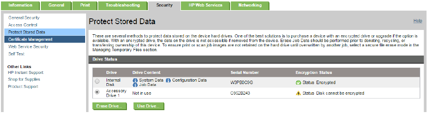  
그림 16: 내장 웹서버(EWS)에서 액세서리 드라이브 설정

액세서리 HDD는 시스템 드라이브와 독립적으로 안전하게 지울 수 있습니다. 두 가지 지우기 작업을 사용할 수 있습니다.

* 드라이브가 HP 보안 디스크로 암호화된 하드 드라이브인 경우 암호화 삭제를 수행할 수 있습니다. (보안 삭제 섹션의 지우기/잠금 해제 섹션 참조)
* 보안 디스크 삭제는 암호화 삭제 외에 드라이브 데이터를 제거하는 가장 안전한 방법을 선택합니다. 방법은 데이터 덮어쓰기를 사용한 보안 삭제 또는 ATA 보안 디스크 삭제입니다.

**참고**: 이 삭제 모드는 장치를 **폐기**할 때 권장됩니다. (보안 삭제 명령 섹션의 보안 디스크 삭제 항목 참조)

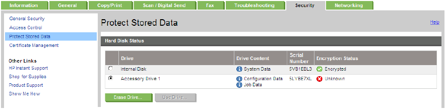  
그림 17: 내장 웹서버(EWS)의 하드디스크 상태 내의 액세서리 드라이브 삭제 명령 

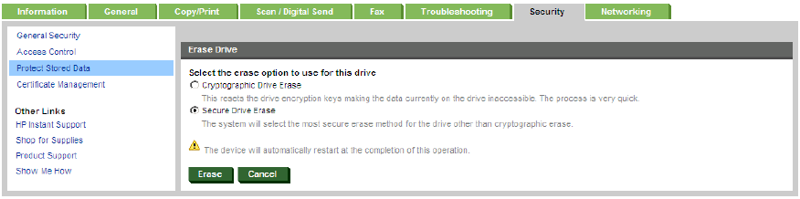  
그림 18: 내장 웹서버(EWS) 내의 액세서리 드라이브 삭제 옵션

## 디스크 삭제 확인

보안 빠른 삭제 또는 보안 삭제가 수행되면 디스크 정리가 성공적으로 완료되었음을 확인하는 항목이 이벤트 로그에 나타납니다. (그림 18) 보안 삭제 또는 사전 부팅 메뉴 삭제/잠금 해제에 대한 확인은 사용할 수 없습니다. 이러한 작업은 모든 로그를 포함하여 프린터 펌웨어를 제거하므로 BIOS에서 작업 완료를 기록할 수 없습니다.

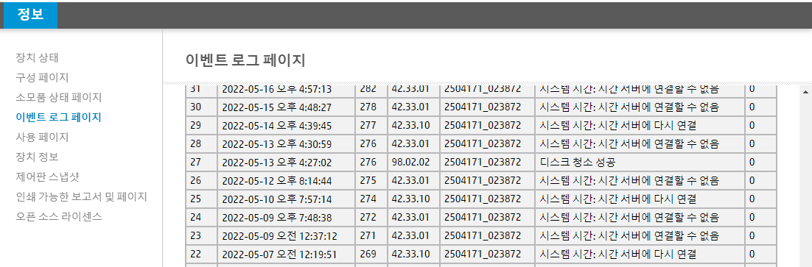  
그림 19: Secure Fast Erase 또는 Secure Sanitize erase 이벤트 로그 항목

## 정부 삭제 기준

이러한 장치는 미국 정부 요구 사항을 충족합니다. (DSS Clearing and Sanitization Matrix AS OF 2007년 6월 28일 및 NIST Special Publication 800-88, Guidelines for Media Sanitation(R1 December 2014).

NIST 800-88은 가장 약한 것에서 가장 강한 것까지 세 가지 삭제 수준을 정의합니다.
* **Clear** 모든 저장 공간 덮어쓰기를 한 번 이상 수행.
* **Purge** 디스크를 디가우싱하거나 드라이브가 지원하는 경우 ATA Secure Erase 수행 명령을 실행합니다(HP에서 사용하는 모든 하드 디스크가 이 명령을 지원함).
* **Destroy** 디스크를 소각하거나 부수거나 화학적으로 파괴합니다.

| **안전 삭제 기능** | **NIST Sanitization level** |
|---|:---|
| Managing Temporary Job Files | **Clear** when using Secure Fast Erase or Secure Sanitize Erase modes |
| Erase Job Data | **Clear** |
| Secure Disk Erase | **Clear** and **Purge** |
| Erase/Unlock encryption disk | **Purge** |
|||

# <u>부록 A: 보안 지우기 데이터 덮어쓰기 및 사양</u>

일반적으로 HDD에서 파일이 삭제되면 디스크의 파일 할당 테이블에서 파일 이름 항목이 지워져 파일의 존재가 제거됩니다. 파일의 데이터는 디스크의 개별 섹터에 여전히 존재하며 해당 섹터가 다른 파일에 할당된 경우에만 덮어씁니다.

HP 보안 삭제 (Secure Erase) 기술은 현재 미국 정부 사양을 준수하는 1회 또는 3회 덮어쓰기를 사용하여 개별 섹터에서 삭제된 파일의 데이터를 임의의 데이터로 덮어씁니다.

참고: 자세한 내용은 정부 삭제 기준 섹션을 참조하세요.

데이터 덮어쓰기를 사용하여 보안 삭제를 활성화하려면 사용 가능한 경우 "파일 삭제 모드"에 대해 다음 옵션을 선택하십시오.

* <u>Non-secure Fast Erase</u>: 표준 파일 시스템 삭제만 수행합니다(파일 데이터를 덮어쓰지 않음).
* <u>Secure Fast Erase 모드</u>: 모든 데이터를 한 번만 덮어씁니다.
* <u>Secure Sanitizing Erase 모드</u>: 모든 데이터에 대해 3단계 덮어쓰기를 수행합니다.

<u>**참고**</u>: 시스템 기본값은 Non-secure Fast Erase 모드입니다. 최상의 덮어쓰기 시스템 성능을 위해서는 Secure Fast Erase 모드를 사용하는 것이 좋습니다.

## 덮어쓰기 사양

Secure Fast Erase 모드는 미국립 표준 기술 연구소(National Institute of Standards and Technology) 특별 간행물 800-88, 미디어 삭제 지침을 따릅니다.

Secure Fast Erase의 경우 삭제된 각 파일의 데이터를 다음으로 한 번 덮어씁니다.

* 16진수 문자 0x48.

Secure Sanitizing Erase 모드는 연속적인 다중 데이터 덮어쓰기를 사용하여 미국 국방부 5220-22.M 사양을 따릅니다.

Secure Sanitizing Erase의 경우 삭제된 각 파일을 다음으로 덮어씁니다.

* 고정 문자 패턴(바이너리 01001000).
* 고정 문자 패턴의 보수(바이너리 10110111).
* 임의의 문자:
    - 장치의 고유한 가동 시간을 시드로 사용하여 각 파일 삭제 작업에 대해 임의 문자의 32k 바이트 버퍼가 생성됩니다.
    - 파일 데이터의 각 바이트는 버퍼에서 고유한 임의의 문자를 사용합니다.
    - 랜덤 문자 버퍼는 최대 32번까지 재사용되며, 새로운 랜덤 데이터를 사용하여 재생성됩니다.

각 덮어쓰기 작업이 성공적으로 완료되었는지 확인하기 위해 덮어쓴 각 바이트가 확인됩니다.

<u>**참고**</u>: NIST SP-800-88 "미디어 삭제 지침"(R1 2014년 12월)은 US DOD 5220-2.M(1997년판) 사양을 대체합니다.

# <u>부록 B: 장치 하드 드라이브 지원</u>

다음 인쇄 장치는 HP FutureSmart 펌웨어 기능과 HP 고성능 보안 하드 디스크를 지원합니다.

<u>참고 A</u>: *는 장치에 선택 사양인 HP 고성능 보안 하드 디스크 액세서리 또는 EIO 액세서리가 필요함을 나타냅니다. 자세한 내용은 제품 데이터 시트를 참조하십시오.

HP Color LaserJet CM4540 MFP  
HP Color LaserJet CP5525xh  
HP LaserJet Enterprise M4555 MFP  

HP LaserJet Enterprise M506 Series*  
HP LaserJet Enterprise M507 Series*  
HP LaserJet Enterprise 500 MFP M525f  
HP LaserJet Managed MFP M525fm  
HP LaserJet Managed Flow MFP M525cm  
HP LaserJet Enterprise MFP M527dn*, M527f, M527c, M527z  
HP LaserJet Managed Flow MFP M527cm  
HP LaserJet Enterprise MFP M528dn*, M528f  
HP LaserJet Enterprise Flow MFP M528c, M528z  
HP LaserJet Enterprise 500 Color M551xh  
HP Color LaserJet Enterprise M553n*, M553dn*, M553x*, M553dh  
HP Color LaserJet Managed M553 series*  
HP Color LaserJet Enterprise M555 series*  

HP Color LaserJet Managed MFP M575dnm*  
HP LaserJet Enterprise 500 color MFP M575dn, M575f  
HP Color LaserJet Managed MFP M575 series  
HP Color LaserJet Managed Flow MFP M575cm  
HP LaserJet Enterprise color Flow MFP M575c series  
HP Color LaserJet Enterprise MFP M577 series  
HP Color LaserJet Managed MFP M577  
HP Color LaserJet Managed Flow MFP M577  
HP Color LaserJet Enterprise MFP M578 series  
HP Color LaserJet Enterprise Flow MFP M578 series  
HP LaserJet Enterprise 600 M603xh  
HP LaserJet Enterprise M604* series  
HP LaserJet Enterprise M605n*, M605dn*, M605x*, M605dh  
HP LaserJet Managed M605 series*  
HP LaserJet Enterprise M606 series*  
HP LaserJet Enterprise M607, M608 series*  
HP LaserJet Enterprise M609dn*, M609x* M609dh  
HP LaserJet Enterprise M610, M611, M612 series*  
HP LaserJet Enterprise MFP M630 series  
HP LaserJet Managed MFP M630  
HP LaserJet Enterprise MFP Flow M630 series  
HP LaserJet Enterprise Managed Flow MFP M630 series  
HP LaserJet Enterprise MFP M631 series  
HP LaserJet Enterprise MFP M632, M633 series  
HP LaserJet Enterprise MFP Flow M632, M633 series  
HP LaserJet Enterprise MFP M634, M635, M636 series  
HP LaserJet Enterprise MFP Flow M634, M635, M636 series  
HP LaserJet Enterprise MFP M651xh  
HP Color LaserJet Managed M651xhm  
HP Color LaserJet Enterprise M652, M653 series*  
HP LaserJet Enterprise MFP M680 series  
HP Color LaserJet Managed MFP M680 series  
HP LaserJet Enterprise MFP Flow M680z  
HP Color LaserJet Managed Flow MFP M680zm  
HP Color LaserJet Enterprise MFP M681 series  
HP Color LaserJet Enterprise Flow MFP M681, M682 series  
HP LaserJet Enterprise 700 M712xh  
HP LaserJet Enterprise MFP M725 series  
HP LaserJet Managed MFP M725 series  
HP Color LaserJet Enterprise M750 series  
HP Color LaserJet Enterprise M751 series*  
HP LaserJet Enterprise 700 color M775 series  
HP Color LaserJet Managed MFP M775 series  
HP Color LaserJet Enterprise MFP M776 series  
HP Color LaserJet Enterprise Flow MFP M776 series
HP LaserJet Enterprise M806  
HP LaserJet Enterprise Flow MFP M830 series  
HP LaserJet Managed Flow MFP M830 series  
HP LaserJet Enterprise M855  
HP Color LaserJet Enterprise M856 Printer series*  
HP LaserJet Enterprise Flow MFP M880 series  
HP LaserJet Managed Flow MFP M880 series  

HP LaserJet Managed E50045dw*  
HP LaserJet Managed E50145dn*  
HP LaserJet Managed MFP E52545dn*  
HP LaserJet Managed Flow MFP E52545c  
HP Color LaserJet Managed E55040dw*   
HP Color LaserJet Managed MFP E57540 series  
HP LaserJet Managed E60055,65,75 series*  
HP LaserJet Managed E60155,65,75 series*  
HP LaserJet Managed MFP E62555dn*   
HP LaserJet Managed MFP E62565h   
HP LaserJet Managed Flow MFP E62565, 75 series  
HP LaserJet Managed MFP E62655dn*  
HP LaserJet Managed MFP E62665hs   
HP LaserJet Managed Flow MFP E62665 series  
HP Color LaserJet Managed MFP E67550dh  
HP Color LaserJet Managed E65050, 60 series*  
HP Color LaserJet Managed E65150, 60 series*  
HP Color LaserJet Managed Flow MFP E67560z  
HP Color LaserJet Managed MFP E67650dh  
HP Color LaserJet Managed Flow MFP E67660z  
HP Color LaserJet Managed E75245dn  
HP Color LaserJet Managed E85055 series*

HP Officejet Enterprise X585 series  
HP OfficeJet Managed Color MFP X585dnm  
HP OfficeJet Managed Color Flow MFP X585zm  

HP PageWide Enterprise Color 765 series*  
HP PageWide Enterprise Color MFP 780 series  
HP PageWide Enterprise Color Flow MFP 785 series  
HP PageWide Managed Color MFP E58650dn  
HP PageWide Managed Color Flow MFP E58650z  
HP PageWide Managed Color E75160dn*  
HP PageWide Managed Color MFP E77650/60 series  
HP PageWide Managed Color Flow MFP E77660  
HP PageWide Managed Color MFP P77960 series  

HP Digital Sender Flow 8500 fn2
HP ScanJet Enterprise Flow N9120 fn2 Document Scanner

# <u>부록 C: Device SSD and eMMC Support</u>

다음 HP 인쇄 장치에는 SSD 스토리지가 포함됩니다:  
HP Color LaserJet CP5525n, dn  
HP LaserJet Enterprise M4555 MFP base (EMEA only)  
HP LaserJet Enterprise 600 M601n, dn, x; M602n, dn, x; M603n, dn  
HP LaserJet Enterprise MFP M630dn  
HP LaserJet Enterprise M651n, dn  
HP LaserJet Enterprise 500 M525 dn, f  
HP LaserJet Enterprise 500 color M551n, dn  
HP LaserJet Enterprise 600 M601n, dn, x; M602n, dn, x; M603n, dn  
HP LaserJet Enterprise MFP M630dn  
HP LaserJet Enterprise M651n, dn  
HP LaserJet Enterprise 700 M712n  
HP OfficeJet Enterprise X555  

다음 HP 인쇄 장치에는 eMMC 스토리지가 포함됩니다:  
HP LaserJet Enterprise M406, M407 series  
HP LaserJet Enterprise MFP M430, M431 series  
HP Color LaserJet Enterprise M455 series  
HP Color LaserJet Enterprise MFP M480 series  
HP LaserJet Enterprise M604, M605, M606 series  
HP LaserJet Managed M605 series  
HP LaserJet Enterprise M607, M608 series  
HP LaserJet Enterprise M609dn, M609x  
HP LaserJet Enterprise M610, M611, M612 series  
HP Color LaserJet Enterprise M652, M653 series  
HP LaserJet Enterprise M506 series  
HP LaserJet Managed M506 series  
HP LaserJet Enterprise M507 series  
HP LaserJet Enterprise M527 dn  
HP LaserJet Managed MFP M527dnm  
HP LaserJet Enterprise MFP M528dn  
HP Color LaserJet Enterprise M552, M553 series  
HP Color LaserJet Managed M553 series  
HP Color LaserJet Enterprise M554 series  
HP Color LaserJet Enterprise M555 series  
HP Color LaserJet Enterprise M652 series  
HP Color LaserJet Managed M651dnm  
HP Color LaserJet Enterprise M751 series  
HP Color LaserJet Enterprise M856 Printer series  
HP LaserJet Managed E40040 series  
HP Color LaserJet Managed E45028 series  
HP Color LaserJet Managed MFP E47528 series  
HP LaserJet Managed E50045dw  
HP LaserJet Managed E50145dn  
HP LaserJet Managed MFP E52545dn  
HP Color LaserJet Managed E55040dw  
HP LaserJet Managed E60055,65,75 series  
HP LaserJet Managed E60155,65,75 series  
HP LaserJet Managed MFP E62555dn  
HP LaserJet Managed MFP E62655dn  
HP Color LaserJet Managed E65050, 60 series  
HP Color LaserJet Managed E65150, 60 series  
HP Color LaserJet Managed E75245dn  
HP Color LaserJet Managed MFP E78223, 28 series  
HP Color LaserJet Managed E85055 series  

HP PageWide Enterprise Color 556 series  
HP PageWide Color 755dn  
HP PageWide Enterprise Color 765dn  
HP PageWide Color MFP 774 series  
HP PageWide Color MFP 779 series  
HP PageWide Managed Color E55650  
HP PageWide Managed Color E75160dn  
HP PageWide Managed Color P75250dn  
HP PageWide Managed Color MFP P77440dn  
HP PageWide Managed Color MFP P77940, 50 series 

다음 HP 인쇄 장치에는 Secure Volatile Storage 암호화가 포함됩니다:  
HP Color LaserJet CP5525n, dn  
HP LaserJet Enterprise M506 series  
HP LaserJet Managed M506 series  
HP LaserJet Enterprise M507 series  

HP LaserJet Enterprise 500 M525 dn, f  
HP LaserJet Enterprise M527dn  
HP LaserJet Managed MFP M527dnm  
HP LaserJet Enterprise MFP M528dn  
HP LaserJet Enterprise 500 color M551n, dn  
HP Color LaserJet Enterprise M552, M553 series  
HP Color LaserJet Managed M553 series   
HP LaserJet Enterprise M577 series  
HP LaserJet Enterprise 600 M601n, dn, x; M602n, dn; M603n, dn  
HP LaserJet Enterprise M604, M605, M606 series  
HP LaserJet Managed M605 series  
HP LaserJet Enterprise M607, M608 series  
HP LaserJet Enterprise M609dn, M609x  
HP LaserJet Enterprise MFP M630dn  
HP Color LaserJet Enterprise M651n, dn  
HP Color LaserJet Managed M651dnm  
HP Color LaserJet Enterprise M652, M653 series  
HP LaserJet Enterprise 700 M712n  
HP Color LaserJet Enterprise M751 series*  
HP LaserJet Managed E50045dw  
HP LaserJet Managed E50145dn  
HP LaserJet Managed MFP E52545dn  
HP Color LaserJet Managed E55040dw  
HP LaserJet Managed E60055,65,75 series  
HP LaserJet Managed E60155,65,75 series  
HP LaserJet Managed MFP E62555dn  
HP LaserJet Managed MFP E62655dn  
HP Color LaserJet Managed E65050, 60 series  
HP Color LaserJet Managed E65150, 60 series  
HP Color LaserJet Managed E75245dn  
HP Color LaserJet Managed MFP E78223, 28 series  

HP OfficeJet Enterprise X555  
HP OfficeJet Enterprise X585  
HP PageWide Enterprise Color 556 series  
HP PageWide Enterprise Color MFP 586 series  
HP PageWide Color 755dn  
HP PageWide Enterprise Color 765dn  
HP PageWide Color MFP 774 series  
HP PageWide Color MFP 779 series  
HP PageWide Managed Color E75160dn  
HP PageWide Managed Color P75250dn  
HP PageWide Managed Color MFP P77440dn  
HP PageWide Managed Color MFP P77940, 50 series  

# <u>부록 D: ATA 보안 삭제가 지원되지 않음</u>

다음 HP 인쇄 장치는 ATA 보안 삭제를 지원하지 않습니다:

HP Color LaserJet CP5525n, dn  
HP LaserJet Enterprise M4555 MFP base (EMEA only)  

# <u>부록 E: HDD 액세서리 옵션 지원 장치</u>    

다음 HP 인쇄 장치에 HDD 액세서리 (옵션)를 사용할 수 있습니다.  

HP LaserJet Enterprise M506 Series  
HP LaserJet Enterprise M507 Series  
HP LaserJet Enterprise MFP M527dn  
HP LaserJet Enterprise MFP M528dn  
HP Color LaserJet Enterprise M553n, M553dn, M553x  
HP Color LaserJet Managed M553 series  
HP Color LaserJet Managed MFP M575dnm  
HP LaserJet Enterprise M604 series  
HP LaserJet Enterprise M605n, M605dn, M605x  
HP LaserJet Managed M605 series  
HP LaserJet Enterprise M606 series  
HP LaserJet Enterprise M607, M608 series  
HP LaserJet Enterprise M609dn, M609x  
HP Color LaserJet Enterprise M652, M653 series  
HP Color LaserJet Enterprise M751 series  

HP LaserJet Managed E50045dw  
HP LaserJet Managed E50145dn  
HP LaserJet Managed MFP E52545dn  
HP Color LaserJet Managed E55040dw  
HP LaserJet Managed E60055,65,75 series  
HP LaserJet Managed E60155,65,75 series  
HP LaserJet Managed MFP E62555dn  
HP LaserJet Managed MFP E62655dn  
HP Color LaserJet Managed E65050, 60 series  
HP Color LaserJet Managed E65150, 60 series  
HP Color LaserJet Managed E75245dn  
HP Color LaserJet Managed MFP E78223, 28 series  
HP PageWide Enterprise Color 765 series HP PageWide Managed Color E75160dn  
HP PageWide Managed Color MFP E77650/60 series  
The following HP printing devices accept the optional EIO HDD Accessory  
HP Color LaserJet CP5525n, dn  
HP LaserJet Enterprise M4555 MFP  