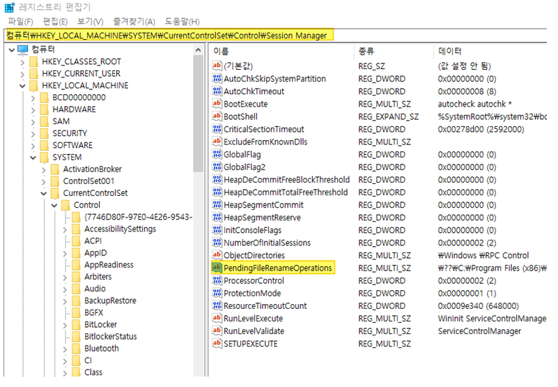

HP Web JetAdmin 설치 중 재부팅을 해도 계속 재부팅을 무한 요구해서 설치가 더 이상 진행이 안되는 경우가 있습니다. 

이와 같은 문제가 발생했을 경우 아래와 같이 레지스트리를 수정해야 해결이 됩니다.

1. 레지스트리에티터 실행

2. "HKEY_LOCAL_MACHINE\SYSTEM\CurrentControlSet\Control\Session Manager" 이동

3. "PendingFileRenameOperations" 항목 삭제
 
아래 스크린 캡쳐 참조

출처: https://support.hp.com/us-en/product/hp-web-jetadmin-software/27905/document/c02496198